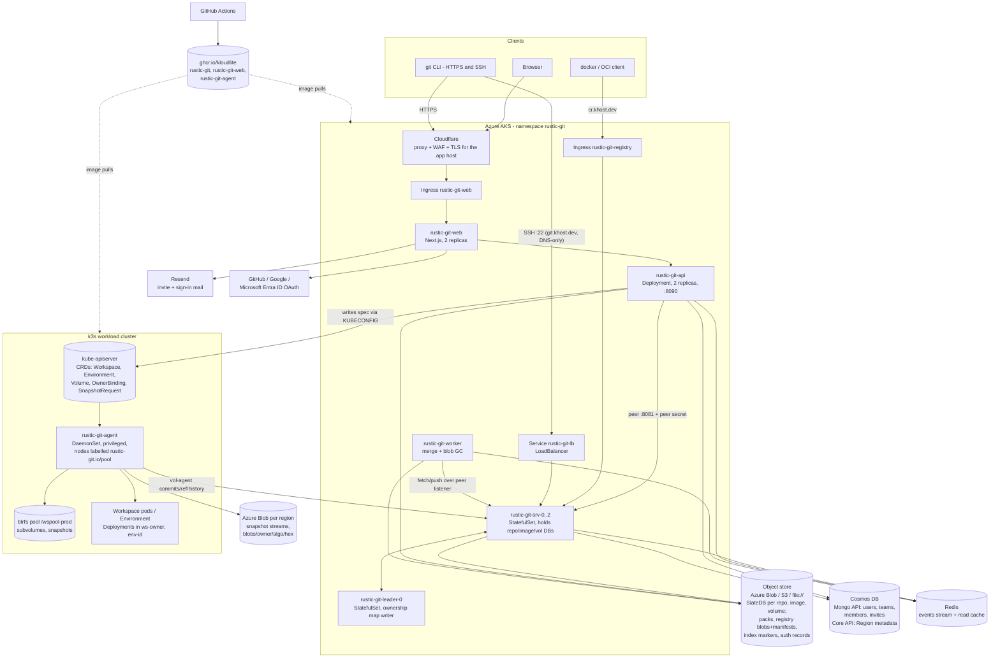

# rustic-git — architecture

A git host, an OCI container registry and a btrfs-backed workspace/environment control plane,
sharing one object store and one identity. Repositories and images live as per-repo SlateDB
databases on an object store (Azure Blob in production, S3 or local disk otherwise), served by a
Rust fleet where exactly one node may hold a given database open; pull-request merges run out of
band in a worker that speaks the git protocol back at the fleet; a Next.js app is the only
browser-facing process; and workspaces/environments are Kubernetes custom resources on a separate
k3s cluster, reconciled by a privileged per-node agent that pushes snapshot bytes back into the
same registry surface the images use.

## Diagram



## Components

| Component | Binary / package | Runs where | Owns | Talks to | Source of truth it holds |
| --- | --- | --- | --- | --- | --- |
| Server tier | `rustic-git` (`bins/server`, args `serve`) | AKS, StatefulSets `rustic-git-leader` (1) and `rustic-git-srv` (3); ports 8080 http, 2222 ssh, 8081 peer, 8082 peer-stream | Git repos, OCI images, volume commit records; SlateDB writer leases | Object store, Redis, Cosmos (Mongo URI; workspaces Cosmos optional), peers | Refs, packs, tags, upload sessions, merge state, volume history — per-DB, one node at a time |
| Leader | same image, `RUSTIC_GIT_LEADER=rustic-git-leader-0` | its own StatefulSet, 1 replica | The ownership map (sole writer); holds no repositories | Object store, peers | Which node owns which routing key |
| Read/team API | `rustic-git-api` (`bins/api`, `crates/api`, `crates/workspaces::api`) | AKS Deployment, 2 replicas, :8090, ClusterIP | `/v1` workspace/environment/region routes; browse reads | Server tier peer listener, Cosmos, Redis cache, k3s API server (mounted KUBECONFIG) | None for repos — writes CR **spec** and Cosmos `Region` |
| Merge worker | `rustic-git-worker` (`bins/worker`, `crates/pulls::merge_worker`) | AKS Deployment, 1 replica | Merges (real `git` binary, bare cache), registry blob GC sweep | Redis `events` group `merge-worker`, server tier over peer HTTP, object store | Nothing — it claims work from the owning node and reports outcomes |
| Node agent | `rustic-git-agent` (`bins/agent`, `crates/workspaces`) | k3s DaemonSet, privileged, `nodeSelector rustic-git.io/pool=true` | Local btrfs pool, workspace pods, Deployments, snapshot push | k3s API (watch/status), server tier `/vol-agent/...`, Azure Blob (or S3/MinIO) | CR **status** only; snapshot bytes it uploads |
| Web app | `rustic-git-web` (`web/apps/web`, Next.js app router) | AKS Deployment, 2 replicas, :3000, `/api/health` probe | Browser UI, Auth.js session | `rustic-git-api` only (server-side), Resend, OAuth providers | None — no DB connection, no signing key |
| CRDs (5) | `crates/workspaces/src/crd.rs`, generated `deploy/k3s/crds.yaml` | k3s, group `rustic-git.io/v1alpha1`, all cluster-scoped, all with `/status` | `Workspace`, `Environment` (API-written), `Volume`, `OwnerBinding` (controller-written children), `SnapshotRequest` (the push work item only) | — | The truth for workspaces, environments and volumes; **not** for snapshots, whose index and records both live on the server tier |
| SlateDB per repo / image / volume | `crates/storage`, `crates/gitbase` | inside the server tier process, backed by the object store | `repo/{owner}/{name}`, `repo/img/{owner}/{name}`, `repo/vol/{owner}/{id}` | object store | Everything per-repo/image/volume; exactly one opener |
| Object store | Azure Blob `az://rustic-git` (prod), `s3://`, `file://`, `mem://` | external | packs, SlateDB files, `blobs/{owner}/{algo}/{hex}`, `manifests/{owner}/{name}/{algo}/{hex}`, `index/{public,private}/...` markers, `auth/...` records | — | Bytes; credentials live here as plain keys so any node can authenticate |
| Cosmos DB | Mongo API (`RUSTIC_GIT_MONGO_URI`, db `kloudlite`) + Core API (`COSMOS_*`, db `workspaces`) | external, Azure | Directory (users, teams, memberships, invites) and cross-cluster `Region` metadata | api tier (writer), server tier (pull migration read) | Directory; `Region` only. Where a CRD and Cosmos could disagree, the CRD wins |
| Redis | `RUSTIC_GIT_REDIS_URL` (Azure Managed Redis) | external | one `events` stream + the api tier's read cache | server, api, worker | Nothing — a nudge and a view, never the record |
| Per-region Azure Blob | `AZURE_ACCOUNT/KEY/CONTAINER` on the agent | external | snapshot streams and block images, content-addressed `blobs/{owner}/{algo}/{hex}` | agent | Snapshot bytes (records live on the server tier) |
| GHCR | `ghcr.io/kloudlite/{rustic-git,rustic-git-web,rustic-git-agent}` | external | container images, pinned by commit SHA | CI pushes, kubelets pull | — |
| GitHub Actions | `.github/workflows/{image,web}.yml` | external | builds/pushes images, cargo test/clippy/audit/deny, bun checks | GHCR | — |
| Resend | `https://api.resend.com/emails` (`web/apps/web/src/lib/mail.ts`) | external | invite and sign-in emails | web | — |
| OAuth providers | GitHub, Google, Microsoft Entra ID (Auth.js) | external | sign-in | web | — |
| Cloudflare | fronts `dev.kloudlite.io` (Flexible SSL) | external | TLS, WAF, rate limiting | web ingress | — |

## External dependencies

| Service | Used for | Which component | Credential env / secret | Without it |
| --- | --- | --- | --- | --- |
| Object store (Azure Blob / S3) | every byte: SlateDB, packs, registry blobs, index markers, auth records | server, api, worker | `RUSTIC_GIT_S3_URL` + `AZURE_STORAGE_ACCOUNT_NAME`/`_KEY` (Secret `rustic-git-storage`), or AWS env | Nothing works |
| Cosmos DB (Mongo API) | directory: users, teams, invites; server tier's pull-request migration read | api (writer), server | `RUSTIC_GIT_MONGO_URI`, `RUSTIC_GIT_MONGO_DB` (Secret `rustic-git-mongo`) | api: team routes report unavailable, browse reads keep working. server: **not** optional — pod must not start without it, or pull requests get orphaned |
| Cosmos DB (Core API, db `workspaces`) | cross-cluster `Region` metadata; vol-agent surface config | api, server | `COSMOS_ENDPOINT`, `COSMOS_KEY`, `COSMOS_DB` (Secret `rustic-git-cosmos`, optional) | Workspace routes 503, feature dark; pods still boot |
| Redis | `events` nudge stream + api read cache | server, api, worker | `RUSTIC_GIT_REDIS_URL` (Secret `rustic-git-redis`, optional) | No data loss: merges fall back to the owner's periodic lanes, the feed's PR half goes quiet (only `repo_created` survives), cache disabled (reads still correct) |
| Per-region Azure Blob | snapshot streams / block images | agent | `AZURE_ACCOUNT`, `AZURE_KEY`, `AZURE_CONTAINER` (Secret `rustic-git-agent`), else `S3_URL` MinIO fallback | Push/restore of workspace state fails; running workspaces keep running |
| k3s API server | the CRDs = truth for workspaces | api (spec), agent (status) | `KUBECONFIG` mounted secret on api; ServiceAccount `rustic-git-agent` on the agent | No workspaces or environments at all |
| Server tier `/vol-agent` | volume commit records and ref moves | agent | `WS_REGISTRY_URL` + `WS_AGENT_TOKEN` (`RUSTIC_GIT_VOL_AGENT_TOKENS` on the server) | Snapshots upload but nothing records them; a token authorizes its own region only |
| Peer secret | node-to-node and api→server authentication | server, api, worker, web (once, at sign-in) | `RUSTIC_GIT_PEER_SECRET` (Secret `rustic-git-peer`) | Fleet cannot forward; api cannot read |
| JWT signing key | registry bearer tokens + user tokens, fleet-wide | server, api | `RUSTIC_GIT_JWT_SECRET` (Secret `rustic-git-jwt`) | Pods fail closed in fleet mode; per-pod random keys would 401 every push after a successful login |
| Cloudflare | TLS, WAF, rate limiting for the app host | web ingress | — | Origin exposed unfiltered; SSH (2222/22) never traversed it anyway |
| GHCR | image distribution (public packages, no pull secret) | all deployments | CI's `GITHUB_TOKEN` (`packages: write`) | No rollouts |
| GitHub Actions | build + test + image push | CI | repo-scoped `GITHUB_TOKEN` | No new images; deploy yamls pin SHAs, so running pods are unaffected |
| Resend | invites, email sign-in links | web | `RESEND_API_KEY`, `RESEND_FROM` (Secret `rustic-git-mail`, optional) | Invite still created; the inviter is shown the link to pass on by hand |
| GitHub / Google / Microsoft Entra ID OAuth | sign-in | web | `AUTH_{GITHUB,GOOGLE,MICROSOFT_ENTRA_ID}_{ID,SECRET}` (Secret `rustic-git-web`, optional) | Provider simply not offered; email + shared password remains if `AUTH_ALLOWED_EMAILS` + `AUTH_SHARED_PASSWORD` are set |
| `alpine/git:2.45.2` | init container that seeds a `gitRepo` workspace over SSH | agent | `WS_GIT_INIT_IMAGE`, `WS_GIT_SSH_HOST`/`PORT` | Git-seeded workspaces cannot clone |
| cert-manager | TLS on the registry ingress (`cr.khost.dev`) | AKS ingress | cluster issuer | Registry TLS expires |
| Azure (AKS, VMs, VNet/NSG) | the two clusters themselves (`deploy/k3s/provision-azure.sh`) | everything | Azure CLI credentials | — |

No DeepSeek / `rustic-git-ai` key, secret, or reference exists anywhere in this repo (grepped
across `*.rs`, `*.ts`, `*.tsx`, `*.yaml`, `*.yml`, `*.sh`, `*.md`) — if such a Secret exists in the
cluster, nothing here reads it.

## Source-of-truth rules

- **One SlateDB per repo/image/volume, open on exactly one node.** Routing (`bins/server/src/router/route.rs`,
  `repo_of` → `route_inner`) derives the ownership key from the URL *before* authentication and
  refuses anything it cannot route. A second opener fences the legitimate owner.
- **The leader is the only writer of the ownership map**, by name (`RUSTIC_GIT_LEADER`), not by
  election. Every pod must agree on that name.
- **Manifest bytes are stored and returned verbatim**; only an explicit `DELETE` or the keep-biased
  GC sweep (`crates/registry/src/gc.rs`) ever removes a blob.
- **The CRDs are the truth** for `Workspace`, `Environment`, `Volume`, `SnapshotRequest`,
  `OwnerBinding`. `/v1` writes spec, controllers write status through `/status`, and RBAC plus a
  ValidatingAdmissionPolicy (`deploy/k3s/agent-{rbac,admission}.yaml`) — not convention — keeps a
  controller out of desired state. Every `/v1` read is a projection of a CR.
- **Snapshot bytes and their commit records live on the server tier / region blob store**, not in
  etcd — the only workspace state outside the cluster.
- **Cosmos holds the directory and `Region` metadata, nothing else.** Where a CRD and Cosmos could
  disagree about a workspace, the CRD wins.
- **Views, never authorization:** `index/` markers, the `rustic-git.io/owner` and `/kind` labels
  (`spec.owner` is the truth; controllers re-stamp labels on reconcile), and the Redis `events`
  stream. Every consumer of `events` keeps a fallback that works with Redis down.
- **Placement is a fact, not a wish:** `Workspace`/`Environment` select on `.status.nodeName`,
  controller-written `Volume`/`OwnerBinding` on `.spec.nodeName`, so two nodes never contend for
  one subvolume.

## Request flows

**git push over HTTP or SSH.** The client hits the app host (Cloudflare → ingress) or SSH on
`git.khost.dev:22` → `rustic-git-lb`. The routing middleware derives `{owner}/{name}` from the URL,
and if this node isn't the owner it forwards to the peer that is (or asks the leader to place it).
The owning node authenticates against `auth/...` in the object store, buffers the pack (capped by
`RUSTIC_GIT_MAX_BODY`, 512 MiB in prod), writes objects, and updates refs in its own SlateDB. It
drops the repo's cached `refs` entry in Redis and publishes an `events` nudge. Neither the cache nor
the nudge is required for correctness.

**docker pull.** `cr.khost.dev` (its own ingress, its own TLS) → `/v2/...`. `docker login` gets a
bearer token from `/v2/token`, answered by whichever node it lands on and signed with the
fleet-wide `RUSTIC_GIT_JWT_SECRET`. The manifest request routes on `img/{owner}/{name}` to the node
holding that image's DB, which returns the stored manifest bytes verbatim. Layers are read from
`blobs/{owner}/{algo}/{hex}` in the object store — per-owner and shared across that owner's images,
which is why no manifest path ever deletes a blob.

**Open a PR and merge it.** The web app calls the api tier, which forwards to the owning node's
peer listener; the pull request is recorded in the repo's own DB. On merge the owner records the
claim and publishes a `MergeRequested` event. The worker picks it up off the `events` consumer
group, claims the job from the owner over HTTP, fetches into a bare cache clone using the real
`git` binary with peer auth, runs `merge-tree --write-tree` (or a throwaway worktree for rebase),
and pushes back with `--force-with-lease` — so branch protection judges it like anyone's push. If
Redis or the worker dies, the owner's 15s `announce_stranded_merges` beat re-announces the job.

**Create a workspace seeded from a repo.** `/v1` on the api tier authenticates the bearer token,
checks team membership through the directory, and creates exactly one unplaced `Workspace` CR —
no node, no `Volume`, no namespace writes. Agents watch their own node's objects; one claims the
object by writing `status.nodeName`, then creates the `Volume` child with an ownerReference. The
Volume controller makes the btrfs subvolume; an `alpine/git` init container clones `owner/name`
over SSH from `WS_GIT_SSH_HOST` with the owner's platform key. Only then does the Deployment come
up in namespace `ws-{owner}`.

**Push a snapshot.** `push` is the one mutating verb and has no separate commit step: the agent
stages a read-only btrfs snapshot locally, uploads the send stream to the region's Azure Blob
container under `blobs/{owner}/{algo}/{hex}`, POSTs a commit record and moves the `main` ref via
`/vol-agent/{owner}/{id}/{commits,ref}` on the server tier — routed like any other repo, so only the
node holding `repo/vol/{owner}/{id}` writes it. A push that dies mid-flight leaves the stage files
and an internal `unpushed` mark, so a retry resumes rather than re-snapshotting. The commit record
carries the source's kind and name in its `state`, because the record outlives the workspace and is
the only thing left that can say what the snapshot was of.

**Browse snapshots.** The server tier is both the index and the record: `GET /api/{owner}/volumes`
lists an owner's volumes from the object store alone (no volume database is opened, so any node can
answer), and `GET /api/{owner}/{name}/volumehistory` reads one volume's commits on the node that
owns it. `/v1/volumes`, `/history`, `/refs` and `restore` on `bins/api` are projections of those
reads over the peer credentials. Nothing user-facing reads a `SnapshotRequest`: a snapshot is a
point in time and outlives the workspace it was taken of, so a listing built from live workspaces —
or from a request that has since been collected — would lose it.

**Stop an environment.** `desiredState: Stopped` is `replicas: 0`, so the stop survives a node
reboot. The controller pushes the environment's own subvolume first and gates the Deployment
deletes on that push having *landed*, not merely been requested — the one place a push happens
without an explicit `/push` call.

## Repo layout

| Path | What |
| --- | --- |
| `crates/core` | errors, logging, JWT helpers shared by every binary |
| `crates/storage` | object store bootstrap, SlateDB store, `auth/`, `index/` markers, Redis `events` + cache |
| `crates/gitbase` | git object plumbing over `gix_odb` (pack writes, ref protection, merge-base) |
| `crates/git` | the git wire protocols (upload-pack v2 only, receive-pack) |
| `crates/pulls` | pull requests, the Cosmos-Mongo directory, the merge worker |
| `crates/registry` | OCI Distribution v1.1 registry, auth, GC sweep |
| `crates/api` | the read/browse API served by `bins/api` |
| `crates/app` | shared server application state and lanes |
| `crates/workspaces` | CRDs, `/v1` routes, Cosmos `Region` store, snapshot engine, registry client |
| `bins/server` | `rustic-git` — git + registry + vol-agent, routing, ownership |
| `bins/api` | `rustic-git-api` — `/v1` and browse, cannot open a repo for writing |
| `bins/worker` | `rustic-git-worker` — merges and blob GC |
| `bins/agent` | `rustic-git-agent` — privileged node controller, btrfs |
| `web/` | turborepo; the Next.js app in `web/apps/web` |
| `deploy/` | `rustic-git.yaml`, `rustic-git-web.yaml` (AKS) and `deploy/k3s/*` (CRDs, agent, RBAC, provisioning) |
| `tests/` | integration suite hosted by the near-empty root package, plus `registry_e2e.sh`, `ws_e2e.sh` |
| `docs/` | design docs and plans under `docs/superpowers/`, benchmarks and reviews alongside |

## Run it

```sh
cargo test                                   # workspace units + tests/*.rs
cargo test --test registry_blobs             # one integration file
cargo clippy --workspace -- -D warnings      # what CI gates on

RUSTIC_GIT_S3_URL=file://./x cargo run -p rustic-git-server -- serve   # no S3; mem:// is lost on exit
                                             # local scratch (host key, cache) lands under ./.local/

cd web && bun install && bun run dev         # lint / typecheck / build / test also available

./tests/registry_e2e.sh                      # real docker push/pull; exit 77 = docker half skipped, not a pass
./tests/ws_e2e.sh                            # server+api+agent+Cosmos+Azure+btrfs against k3s;
                                             # exit 77 = a prerequisite was missing (root btrfs,
                                             # reachable cluster with CRDs, COSMOS_*/AZURE_* env)
```

Deploying: CI builds on push to master, but `web.yml` only runs when `web/**` changed, so the two
images do not move in lockstep — pin each yaml to the last SHA that actually built that image, then
`kubectl apply`. Details and the traps are in `CLAUDE.md`.
