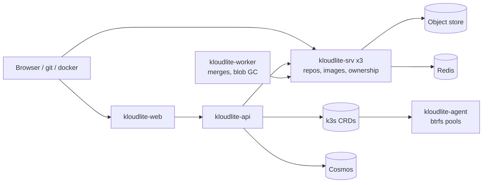

# kloudlite

A git host, an OCI container registry and a btrfs-backed workspace/environment control plane,
sharing one object store and one identity. Repos and images are per-repo SlateDB databases on an
object store, served by a Rust fleet where exactly one node holds a given database open. Workspaces
and environments are Kubernetes custom resources on a separate k3s cluster, reconciled by a
privileged per-node agent.



| Component | Where | Role |
| --- | --- | --- |
| `kloudlite` (`bins/server`) | AKS StatefulSet, 3 pods | git + registry; one opener per DB; elected ownership map |
| `kloudlite-api` (`bins/api`) | AKS Deployment | `/v1` workspaces/environments, browse reads, admin process |
| `kloudlite-worker` (`bins/worker`) | AKS Deployment | PR merges with real `git`, registry blob GC |
| `kloudlite-agent` (`bins/agent`) | k3s DaemonSet, privileged | reconciles CRDs, btrfs snapshots, node-to-node replication |
| `kloudlite-web` (`web/apps/web`) | AKS Deployment | Next.js UI; talks only to the api tier |
| `kloudlite-slo` (`bins/slo`) | AKS CronJobs | synthetic-user probe, fast/hourly/weekly/monthly suites |

## Layout

| Path | What |
| --- | --- |
| `crates/` | `core`, `storage`, `gitbase`, `git`, `pulls`, `registry`, `api`, `app`, `workspaces` |
| `bins/` | the binaries above plus `gateway` (workspace SSH tunnel) and `kl` (user CLI) |
| `web/` | turborepo; the app in `web/apps/web` |
| `deploy/` | AKS manifests, `deploy/k3s/` (CRDs, agent, RBAC), `deploy/dev/` (the dev pod), `slo.md`, `alerts.md` |
| `tests/` | integration suite plus `registry_e2e.sh`, `ws_e2e.sh` |
| `docs/` | capacity model, migrations, the design docs the code cites |

## Working on it

Code is built, tested and shipped from the `dev` pod on AKS, never the laptop:
`deploy/dev/README.md` is the recipe. `CLAUDE.md` holds the invariants, the traps and the
deploy flow.

```sh
cargo test                                   # units + tests/*.rs
cargo clippy --workspace --all-targets -- -D warnings
cd web && bun install && bun run dev
```
