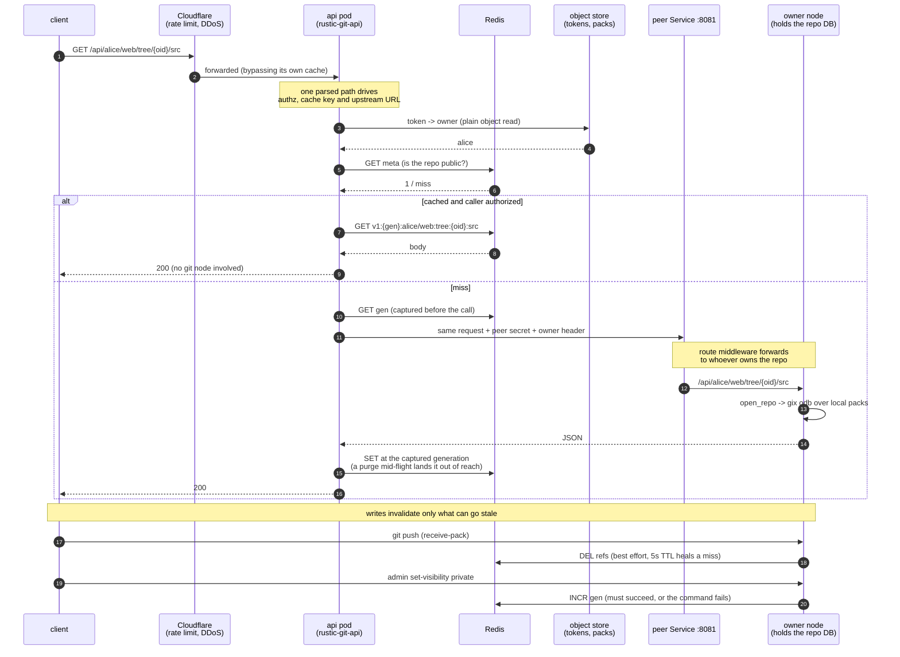

# rustic-git

A git server that stores pack files in S3 (via `object_store`) and refs/tokens/keys
in SlateDB, speaking both the git HTTP smart protocol and SSH.

## Forks

A fork gets its own copy of the source's objects, made with the object store's server-side copy
so the bytes never pass through the server. Repos never share storage.

That costs duplicated bytes, which is the right trade here: forks are rare, object storage is
cheap, and sharing a pile means garbage collection has to see every repo using it — which
constrains where repos may live, requires cross-node coordination to collect, and makes
cross-repo object exposure possible at all. Owning objects outright makes collection a local,
per-repo operation and removes that exposure structurally.

## Running more than one node

One SlateDB database per repo, at `repo/{owner}/{name}`, and the repo is the unit of ownership. A
plain round-robin LoadBalancer sits in front and nothing there needs to understand git. Who owns
which repo is not derived — it is written down. `rustic-git-leader-0` keeps a map of `repo → (node,
expires)` in its own SlateDB database at `cluster/ownership`, and is its only writer; every other
node opens it read-only and follows.

**Leadership is a name, not a decision.** The leader is `RUSTIC_GIT_LEADER` when set — in the
cluster that is `rustic-git-leader-0`, a StatefulSet of its own — and otherwise derived from the
node's own identity (strip the ordinal off `RUSTIC_GIT_SELF`, append `-0`). Every pod must agree on
the value: two nodes with different answers open the map twice and fence whichever was serving.
A StatefulSet guarantees at most one pod per ordinal, so two leaders cannot exist and there is no
election to get wrong. There is deliberately
**no failover to ordinal one**: a leader that is unreachable blocks new claims; it is not replaced.

Routing a request is one local map read. If the map names this node, it serves; if it names another,
it forwards over the peer ports (8081 HTTP, 8082 stream); if nobody owns the repo, it asks the
leader for it — one round trip, and only when a repo is cold. A claim that cannot be granted (the
leader is unreachable) returns 503 rather than serving anyway, because serving on a failed claim is
exactly the two-writer bug this removes. A follower's copy of the map may be stale (it polls the
manifest every 200ms); that costs one extra hop and can never produce a second owner, because only
the leader grants.

**A node holds a repo's lease exactly as long as it holds that repo's database open.** A claim
precedes the open, a renewal every 3s (batched, one message per node) continues while the handle is
held, and eviction begins with a release. Releasing does not delete the entry — it shortens it to a
500ms drain, during which this node is still the owner and still serving; only then is the database
closed. Deleting instead, or closing before the drain, lets another node open a database this one is
still holding and fence it, which is a failure this system has already produced on a real cluster.
The other direction holds too: a node whose renewal is declined has lost the lease and closes that
database at once rather than waiting to be fenced.

The peer ports carry a shared secret (`RUSTIC_GIT_PEER_SECRET`, from Secret `rustic-git-peer`)
because this cluster runs with `networkPolicy: none`: anything on the pod network can otherwise reach
them. Scaling the servers is `spec.replicas` on `rustic-git-srv` **and** `RUSTIC_GIT_REPLICAS` on every
pod, kept equal: the leader hands repos only to `{RUSTIC_GIT_SERVER_PREFIX}-{0..REPLICAS-1}`. There
is no peer list beyond that count, and `RUSTIC_GIT_REPLICAS` is required rather than defaulted once
`RUSTIC_GIT_PEER_SVC` is set — a pod missing it refuses to start instead of silently assuming 1.

Read-only replica nodes were removed. A follower can only serve refs as stale as its last manifest
poll (~1s), which breaks read-your-own-writes — push, then fetch from another node and the commit is
missing. Since repos are already the unit of ownership, sending a repo's whole traffic to one node
costs nothing and removes the staleness window entirely. Fanout across repos, not within one.

**Limits worth knowing:**

- **While `rustic-git-leader-0` is restarting, no repo can be claimed.** ~6s, measured on this
  cluster after the startup-probe fix; it was ~20s when the probe polled every 10s.
  Repos already open keep serving throughout — their holders have the databases and renewals are
  advisory — and the map survives the restart, so nothing is rebuilt. Cold repos get a 503.
- **A node partitioned from the leader** keeps serving what it holds and cannot claim anything new.
  It does not become leader.
- **A dead node's repos move within about a second**, not in the 10s lease TTL. A node that fails to
  connect to the owner waits 350ms, re-reads the map, and — if it still names the same unreachable
  node — asks the leader to force the repo over. Only GET requests, only connect failures, and only
  after that second failure: one dropped connect never moves a repo. The leader refuses to
  force-grant an entry written in the last second, so two nodes recovering from the same dead owner
  cannot ping-pong the repo; the loser is told the winner and forwards there. If the old owner was
  in fact alive and merely unreachable, the grant fences it and an in-flight push there fails and is
  retried — the intended trade against ten seconds of 502s. A repo whose lease simply lapses is
  still claimed by whoever is next asked for it.
- **A stale grant is not a correctness problem.** SlateDB's writer epoch fences the second opener,
  whose pool reports it and re-routes. The map buys accuracy; fencing is what buys safety. Precisely:
  a node that loses a repo is stopped at its next durable write — the transaction commit is where
  the higher epoch is seen — so no ref update it acknowledged is lost and no two commits interleave.
  Until its next pool access notices, it may still serve *reads* from its snapshot; that is a
  moment of staleness on the way out, not a second writer.
- **On SIGTERM the two HTTP listeners drain; SSH sessions do not.** An SSH session in flight on a
  terminating pod is cut when the drain ends; the preStop delay is what makes that rare (see the
  manifest comment for the timing arithmetic). The pool releases every lease and drains before it
  closes, so peers take the repos over without fencing anything.
- **Liveness is `/healthz`, which reflects the object store.** During an object-store outage longer
  than ~90s every pod is restarted, which achieves nothing but is harmless — the pods come back into
  the same outage.
- **Single node** (`RUSTIC_GIT_PEER_SVC` unset) runs with no ownership map at all: one node owns
  everything by construction, so there is nothing to claim, renew or prune.

### Deploying

The peer ports need a shared secret because this cluster enforces no NetworkPolicy
(`az aks show -n kolomi-cluster -g kolomi-rg --query networkProfile.networkPolicy -o tsv` → `none`):

```
kubectl -n rustic-git create secret generic rustic-git-peer \
  --from-literal=secret="$(openssl rand -hex 32)"
```

The read API needs a Redis URL in a secret. Without it the api pods still run — every request
just goes to a git node instead of the cache:

```
kubectl -n rustic-git create secret generic rustic-git-redis \
  --from-literal=url="rediss://:<key>@<host>:10000"
```

Both tiers need that secret, not just the api pods. Invalidation runs on the **git nodes** — a push
drops the repo's `refs` entry, a visibility flip or a delete bumps its generation — so a fleet
without the Redis URL caches answers that nothing can ever purge, and `set-visibility private`
reports success while orphaning nothing. A disabled cache returning success is correct for reads
and silent in exactly this case, which is why the URL belongs on both workloads.

**Redis must run `maxmemory-policy volatile-lru`, and this is correctness, not tuning.** Cached
answers carry a TTL; the per-repo generation counters that decide which answers are still reachable
carry none. Under `volatile-lru` only keys with an expiry are eviction candidates, so pressure
evicts answers and never the counters. Under `allkeys-lru` an evicted counter reads back as
generation 1 — the value from before the last purge — and every stale answer it was meant to orphan
becomes visible again, including for a repo that was just made private.

Then `kubectl apply -f deploy/rustic-git.yaml`.

The manifest pins both workloads to an image digest tag rather than `:latest`, so applying it is an
explicit decision about which build runs rather than whatever was pushed last.

The api tier ships as a `ClusterIP` Service. It is meant to sit behind Cloudflare, which supplies
the rate limiting and DDoS protection this codebase deliberately does not implement; exposing it as
a `LoadBalancer` before that is in place puts an unmetered read API on the internet. When you do
switch it, set `loadBalancerSourceRanges` to Cloudflare's ranges in the same change — the manifest
ships a deliberately invalid placeholder so a premature apply is rejected by the API server rather
than silently accepted. Do not "fix" that rejection by deleting the field: absent means open to
everyone, with no warning.

Two limits worth knowing before you rely on the edge: SSH on 2222 cannot traverse Cloudflare's HTTP
proxy, so git-over-SSH is neither rate limited nor shielded by it; and the origin must be locked to
Cloudflare's ranges or the whole edge is one `curl` away from irrelevant.

Packs are unaffected: they are content-addressed and immutable, so every node reads them straight
from `objects/{owner}/{name}/`. Credentials live as plain object keys (`auth/...`), readable by
every node.

Opening a database is not free — measured at ~1.7s against a bucket in another region, ~0.8ms of
which is SlateDB itself; the rest is sequential object-store round trips. Put the nodes in the
bucket's region. `RUSTIC_GIT_WARM_TTL_SECS` (default 300) and `RUSTIC_GIT_MAX_WARM` (default 64)
keep recently used repos open so only the first request per repo pays it.

Most `admin` commands open the repos they touch, so stop the node serving those repos first (a
concurrent admin process fences the server). `set-visibility` is the exception: with either
`RUSTIC_GIT_UPSTREAM` or `RUSTIC_GIT_PEER_SECRET` set it posts to the peer Service instead, and the
routing middleware delivers the write to the node that owns the repo — nothing to stop, and no
second writer. With NEITHER set it writes directly and says so on stderr: this process cannot see
whether a node is serving the repo, so the direct write is an assumption it is announcing, not a
guarantee it can make. Export both on any box that administers a live fleet.

`GET /healthz` returns 200 and the warm-database count. Tokens are stored hashed; re-issue any token
minted before this (`admin add-token`).

## Usage

```
rustic-git serve
rustic-git admin create-repo <owner>/<name>
rustic-git admin fork <src-owner>/<src-name> <owner>/<name>   # copies objects and refs
rustic-git admin delete-repo <owner>/<name>
rustic-git admin repack <owner>/<name>                        # consolidate the fork network into one pack
rustic-git admin add-token <owner>        # prints a new access token
rustic-git admin add-key <owner> <pubkey-file>
rustic-git admin set-visibility <owner>/<name> public|private   # routed to the repo's owner when RUSTIC_GIT_PEER_SECRET is set
rustic-git admin set-image-visibility <owner>/<image> public|private   # direct write only when no fleet is configured; refuses otherwise, no browse route exists to route it
rustic-git admin purge-cache <owner>/<name>
rustic-git-api                                                # read + team API; needs RUSTIC_GIT_UPSTREAM
```

## Environment variables

- `RUSTIC_GIT_S3_URL` — **required** for all commands: object store URL, e.g. `s3://bucket`
  (reads `AWS_*` env vars). `mem://` is an in-memory store for testing only — nothing is
  persisted and everything is lost on exit.
- `AWS_PROFILE` — if `AWS_ACCESS_KEY_ID` is unset, static keys and `region`/`endpoint_url` are read
  from `~/.aws/credentials` and `~/.aws/config` for this profile (default `default`).
  SSO / assume-role profiles are not supported.
- `AWS_ENDPOINT`, `AWS_REGION` — for S3-compatible stores. Example for DigitalOcean Spaces:
  `AWS_PROFILE=do AWS_ENDPOINT=https://sgp1.digitaloceanspaces.com AWS_REGION=sgp1 RUSTIC_GIT_S3_URL=s3://rustic-git`

The rest apply to `serve`:

- `RUSTIC_GIT_S3_TIMEOUT_SECS` — per-request S3 timeout (default 900). Repack uploads a whole
  network in one PUT, so a distant bucket needs more than object_store's 180s default.
- `RUSTIC_GIT_FLUSH_INTERVAL_MS` — how often the ref store flushes its write-ahead log
  (default 100). A ref update waits for the next flush, so this sets push latency when pushes
  arrive one at a time; lowering it costs more object-store writes. See "Write throughput".
- `RUSTIC_GIT_MAX_BODY` — max request body in bytes (default 2 GiB). Enforced before authentication.
- `RUSTIC_GIT_CACHE_DIR` — local pack/object cache directory (default `./cache`).
- `RUSTIC_GIT_WARM_TTL_SECS` — how long an unused repo database stays open (default 300).
- `RUSTIC_GIT_MAX_WARM` — ceiling on simultaneously open repo databases (default 64).
- `RUSTIC_GIT_HTTP_ADDR` — HTTP listen address (default `0.0.0.0:8080`).
- `RUSTIC_GIT_SSH_ADDR` — SSH listen address (default `0.0.0.0:2222`).
- `RUSTIC_GIT_HOST_KEY` — path to an OpenSSH host key; generated if missing (default `./host_key`).
- `RUSTIC_GIT_PEER_SVC` — headless Service FQDN the peer hostnames hang off (e.g.
  `rustic-git.rustic-git.svc.cluster.local`). Unset means single-node: no ownership routing.
- `RUSTIC_GIT_SELF` — this pod's stable name (`rustic-git-srv-2`). Required when
  `RUSTIC_GIT_PEER_SVC` is set; the map records ownership under it.
- `RUSTIC_GIT_PEER_SECRET` — shared secret for the peer ports. Required when `RUSTIC_GIT_PEER_SVC`
  is set.
- `RUSTIC_GIT_PEER_ADDR` — peer HTTP listen address (default `0.0.0.0:8081`). The peer stream port
  is derived as peer port + 1 (8082 by default), not separately configurable.
- `RUSTIC_GIT_LEADER` — the writer of the ownership map (`rustic-git-leader-0`). When unset it is
  derived from `RUSTIC_GIT_SELF` with the ordinal replaced by 0, which only works while the leader
  and the servers share one StatefulSet. Every pod must carry the same value.
- `RUSTIC_GIT_SERVER_PREFIX` — the StatefulSet prefix of the serving pods (`rustic-git-srv`).
  Defaults to the leader's own prefix. Set it whenever `RUSTIC_GIT_LEADER` is.
- `RUSTIC_GIT_REPLICAS` — how many serving pods exist, `{prefix}-0` through `{prefix}-N-1`. The
  leader hands repos only to these, so it must equal the servers' `spec.replicas`. **Required
  whenever `RUSTIC_GIT_PEER_SVC` is set**: the process refuses to start without it, because the old
  silent default of 1 made a pod that lost the variable hand every repo to `{prefix}-0`. It defaults
  to 1 only in single-node mode, where there is nobody else to hand a repo to.

The rest apply to `rustic-git-api`:

- `RUSTIC_GIT_UPSTREAM` — base URL of the git fleet's **peer** Service (default
  `http://rustic-git:8081`), not the public one: browse routes are only mounted on the peer
  listener.
- `RUSTIC_GIT_PEER_SECRET` — **required**: the same shared secret the git nodes run with. The api
  process talks to them over the peer listener and refuses to start without it.
- `RUSTIC_GIT_API_ADDR` — HTTP listen address (default `0.0.0.0:8090`).
- `RUSTIC_GIT_REDIS_URL` — optional. Without it, the api process still answers every request,
  just always by asking a git node instead of serving from cache.
- `RUSTIC_GIT_MONGO_URI` — optional; a Cosmos DB (Mongo API) connection string. Holds users and
  teams. Without it the browse routes answer normally and only `/v1/*` reports 503: a directory
  outage must not stop reads that never needed it.
- `RUSTIC_GIT_MONGO_DB` — database name (default `kloudlite`).
- `RUSTIC_GIT_JWT_SECRET` — at least 32 bytes. Signs the identity tokens the web app presents on
  later calls and the registry's bearer tokens. Optional in code (a random per-process key is
  generated), required in any fleet: a token minted by one process must verify on every other.

The merge worker (`rustic-git-worker`) reads `RUSTIC_GIT_S3_URL`, `RUSTIC_GIT_UPSTREAM`,
`RUSTIC_GIT_PEER_SECRET` and `RUSTIC_GIT_REDIS_URL` as the api does, plus:

- `RUSTIC_GIT_WORKER_CONCURRENCY` — lanes per pod (default 4, clamped to 1–64). A lane is a task
  that consumes the `events` stream and nudges the owning node; raise this before adding replicas.
- `RUSTIC_GIT_CACHE_DIR` — scratch directory (default `./.local/cache`). Each lane writes a
  `worker-alive.{i}` heartbeat here, and the pod's liveness probe fails unless every one of the
  `RUSTIC_GIT_WORKER_CONCURRENCY` files is fresh — which is how a process with no listener is
  probed at all.

## Cloning

```
git clone http://x:<token>@host:8080/owner/name.git
git clone ssh://git@host:2222/owner/name.git
```

HTTP basic auth accepts any username (e.g. `x`); only the password (the token) is checked.

The server speaks git protocol v2 only, no v0/v1 fallback. git 2.26+ defaults to v2; older
clients need `git -c protocol.version=2 <command>`.

## Browsing

`rustic-git-api` is a separate binary and a separate process: a stateless read and team API in front of the git fleet
(`/api/{owner}/{name}/...`), backed by an optional Redis cache. Branch names appear in exactly
one endpoint, `/refs`, which resolves a name like `main` to the commit id it currently points at.
Every other endpoint — tree, blob, log, commit — takes that id, never a branch name.

That is what makes the cache work: an id is a fingerprint of content and can never mean something
else, so a cached answer keyed on it is never stale and any api pod can serve it without asking the
node that owns the repo. Only `/refs` is a moving target and is cached for 5 seconds instead of
being kept indefinitely.

### The whole flow



Every URL except `/refs` names an object id, so the cache hit at the top needs no git node at all —
that is the entire point of the shape.

### Visibility

Repos are private by default: reads and clones need a token whose owner matches the repo's owner.
`admin set-visibility <owner>/<name> public` opens a repo to reads *and* clones by **everyone** —
anonymous callers and any authenticated caller alike, not just the owner. Presenting a token never
grants less than presenting none. Pushing and admin always require the owner's token, public or
not: public grants read, never identity.

The flip is the one admin write that changes live authorization, so it does not touch the database
directly: it goes to `POST /api/{owner}/{name}/visibility` on the peer listener, and the routing
middleware forwards it to the node that owns the repo. One writer, one view — a direct write from a
second process would leave the serving node authorizing from its own stale handle for seconds. That
endpoint is peer-only: an `/api/` request on the public listener is refused, never forwarded.

A private repo answers 404, never 403 — a stranger cannot tell it from a repo that does not exist.

Flipping a repo back to private bumps a per-repo generation counter, which makes every cached
answer for it unreachable at once. That call can fail (Redis may be down), and when it does the
command fails loudly rather than reporting a success it did not achieve: the repo is private in the
database but its cached answers are not yet orphaned, and `admin purge-cache <owner>/<name>` is the
retry. This is the one place the cache is *not* allowed to fail quietly — everywhere else a cache
outage only costs latency, here it would cost the guarantee itself.

### `api` is a reserved owner name

No repo may be owned by `api`, because `/api/{owner}/{name}/...` would otherwise be both that
repo's git route and another repo's browse route — and the routing middleware and the HTTP router
resolve that ambiguity differently, which is how one repo's request ends up routed by another
repo's ownership. Reserving the name removes the ambiguity instead of adjudicating it. A repo
created before this reservation keeps working over SSH and can be moved with `admin fork`; its
git-HTTP routes are gone.

## Pack index

A node needs to know which pack files a repo has before it can serve anything. That used to be a
listing of the object store on every request — a network round trip in front of every clone, fetch
and push. A node records each pack in the ref store as it uploads it, so the list comes from the
same database as the refs: no listing, and the pack set always matches the refs alongside it. Repos written before the index existed fall back to one listing, which is then
recorded.

Measured against a bucket in another region, the server-side advertisement went from ~136ms to
~51ms. End-to-end `git ls-remote` is unchanged at ~0.3s, being dominated by process startup and two
HTTP round trips; the win is in server-side work and in not spending an object-store request per
git request, which matters for rate limits and cost long before it shows up as latency.

## Write throughput

Measured with `cargo test --release --test throughput -- --ignored --nocapture` against
DigitalOcean Spaces in Singapore (~200ms RTT), one node. A push costs one ref-update
transaction, so this is the ref store's ceiling per node:

| concurrent ref updates | durable ops/sec |
|---|---|
| 1 | ~9 |
| 8 | ~70 |
| 32 | ~300 |
| 128 | ~1000 |
| 512 | ~2500 (plateau) |

Writes are durable before returning (`await_durable`), and object-store latency is largely
hidden: the same benchmark against an in-memory store gives nearly identical numbers, because
concurrent commits batch into one flush. What a single client feels is therefore not bandwidth
but the flush cadence — roughly 70-115ms per push, floored by the write-ahead log flush interval
and the round trip of one small object write. Lowering `RUSTIC_GIT_FLUSH_INTERVAL_MS` from 100 to
5 moves serial throughput from ~9 to ~14 ops/sec and no further; past that the object store's own
latency dominates.

The practical reading: the ref store is not the bottleneck for a git server. Pack indexing (CPU)
and pack upload (bandwidth) will saturate long before 2500 pushes/sec. Spread repos across nodes to
multiply this figure — each repo is an independent database.

## Container Images

The same node also speaks the OCI Distribution API: `GET/PUT /v2/...` blobs, manifests, tags,
referrers, `_catalog`. An image lives at `{owner}/{image}` — its own namespace, not a git repo. A
repo and an image of the same name are different objects: no repo needs to exist first, and no
create step exists at all — the first push makes the image. Images are private by default, same as
repos.

```
# <host>:8080 is a local run; the cluster's registry is cr.khost.dev over 443.
docker login <host>:8080 --username <owner> --password-stdin   # a token from admin add-token, and
                                                               # the username must be its owner
docker push <host>:8080/<owner>/<image>:<tag>
docker pull <host>:8080/<owner>/<image>:<tag>
```

Auth accepts the same shapes as git: Basic with a long-lived token from `admin add-token`, or the
spec's Bearer flow (`WWW-Authenticate: Bearer realm=".../v2/token"`, then `GET /v2/token` for a
short-lived scoped bearer) that `docker`/`podman` use automatically.

Images carry visibility as repos do, but blobs are addressed by digest **per owner**, not per
image — `blobs/{owner}/sha256/{hex}`, no image name in the path. A known property of that layout:
once any one image of a team is public, anyone who knows a digest can read any blob of that team's
images by digest, including a blob that belongs only to a private one. This is not a bug to route
around; it is what per-owner blob sharing means.

Knobs specific to the registry (the rest apply to `serve` as above):

- `RUSTIC_GIT_EXTERNAL_URL` — the base URL advertised in the `WWW-Authenticate` challenge and
  `/v2/token`'s realm (default `http://localhost:8080`). Must be a URL the **client** can reach,
  not this pod's own address — the challenge is useless if it names something only the cluster
  can see.
- `RUSTIC_GIT_MAX_LAYER` — largest single blob (layer) accepted, in bytes (default 10 GiB).
  Checked before the body is stored. Separate from `RUSTIC_GIT_MAX_BODY`: a layer and a git push
  are different sizes of thing, and sharing one cap would make whichever default is smaller the
  ceiling for both.

Layer bodies stream through the object store's multipart API rather than being buffered, so an
S3-backed deployment **must** have a lifecycle rule that aborts incomplete multipart uploads (a
few days is plenty). Every refusal the registry itself raises aborts the upload, but a part upload
that fails while the write is being finished leaves parts behind with no handle left to abort
them, and un-aborted parts are billed storage that no listing shows.
- `RUSTIC_GIT_BLOB_GRACE_SECS` — how long an upload session that has not finished is protected
  from the garbage sweep (default 3600). Too short and a slow push loses its blobs out from under
  it; the sweep only ever removes what has sat idle longer than this.
- `RUSTIC_GIT_UPLOAD_GRACE_SECS` — how long an upload *session* (the `upload/{uuid}` row and its
  staging object) may sit idle before the GC sweep removes it (default 86400). The other half of
  the bound `RUSTIC_GIT_BLOB_GRACE_SECS` gives: a session leaks at most grace × `RUSTIC_GIT_MAX_LAYER`.
- `RUSTIC_GIT_JWT_SECRET` — signs registry bearer tokens (shared with the identity tokens
  documented above). Unset means a random per-process secret, so every token dies with the
  process — fine for a single dev run, and in a fleet it shows up as clients needing to
  `docker login` again, never as a forged token being accepted.

`tests/registry_e2e.sh` drives a real client (`docker` by default, `CLI=podman` to switch) through
build/push/pull/mount against a running node — not part of `cargo test`, since it needs a container
daemon. Its first half (auth, a blob round-trip, a manifest round-trip, tags, `_catalog`) needs
only `curl` and a running node, and runs on its own; the docker/podman half fails loudly and exits
early if no daemon is reachable, instead of failing partway through a build. Exit status: `0` both
halves ran and passed, `77` the curl half passed but the docker/podman half was skipped (no
daemon), anything else a real failure — `77` is a skip, and CI must not treat it as a pass.

**What has actually been verified:** the curl-only half, run against a live node (`serve` backed by
a local `file://` store — see `object_store` in `src/config.rs`. `file://` exists for local
development and single-node testing only, not as a supported deployment mode: it takes a
filesystem path from configuration and creates directories at that path. It let an `admin` command
and `serve` share state across processes without needing S3). It passed: `/v2/` carries the version
header, `/v2/token`
mints a bearer, a blob PUT/GET round-trips, a manifest PUT/GET returns byte-identical bytes, and
both `tags/list` and `_catalog` report the pushed image.

**What has not been run, anywhere:** the docker/podman half (no container daemon is available in
that environment) and the OCI conformance suite (the binary isn't available either). Do not read
either as passing — nobody has run them yet. Run `tests/registry_e2e.sh` with a real daemon before
trusting the docker/podman path, and run the conformance suite per Step 3 of the task-12 brief if
you want that signal too.

## Workspaces and environments

btrfs-backed dev workspaces and docker-compose environments, running as their own control plane
(`crates/workspaces`, `bins/api`, `bins/agent`) alongside the git server — separate metadata
(Cosmos DB + per-region Azure blobs for snapshot bytes), separate auth, but a pushed
workspace/environment lands in the SAME registry namespace container images use
(`vol/{owner}/{id}` next to `img/{owner}/{name}`), served by the git server tier
(`bins/server/src/vol_agent.rs`), not `bins/api`. `commit` is local-only (a snapshot + lineage
append, no network); `push` is the verb that actually reaches that registry — history and refs
stay empty until push, and `fork` always grafts onto the last PUSHED history, never an uncommitted
live write. Full design (domain model, API, scheduler, engine) is in
`docs/superpowers/specs/2026-08-24-workspaces-environments-design.md`. `tests/ws_e2e.sh` drives
the real thing end to end (create/write/commit/push/fork/clone/env up/down) across all three
binaries — `rustic-git` (server tier, hosts the agent work surface), `rustic-git-api`
(`/v1/workspaces|environments|regions|volumes`), `rustic-git-agent` — against a real Cosmos DB and
Azure account on a btrfs+root Linux box; see its header for exit-code conventions.

## License

Server Side Public License v1 (SSPL-1.0). See [LICENSE](LICENSE).
