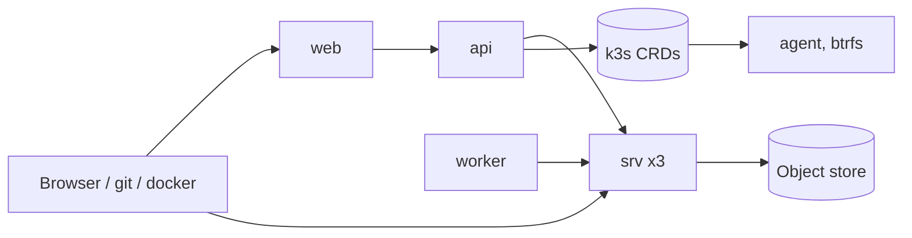

# kloudlite

Git hosting, a container registry and btrfs-backed dev workspaces, one identity across all three.
Repos and images are per-repo databases on an object store, served by a Rust fleet where exactly
one node holds a database open. Workspaces and environments are Kubernetes custom resources on a
k3s cluster, reconciled by a per-node agent.

| Path | What |
| --- | --- |
| `bins/` | `server` (git + registry), `api` (`/v1`, admin), `worker` (merges, GC), `agent` (k3s node controller), `gateway`, `kl`, `slo` |
| `crates/` | the libraries behind them |
| `web/` | Next.js app in `web/apps/web` |
| `deploy/` | AKS and k3s manifests, `deploy/dev/` (the dev pod), `slo.md`, `alerts.md` |
| `tests/` | integration suite and the two e2e scripts |
| `docs/` | capacity model, migrations, design docs |

Code is built, tested and shipped from the `dev` pod on AKS, never a laptop: see
`deploy/dev/README.md`. `CLAUDE.md` has the invariants and the deploy flow.
