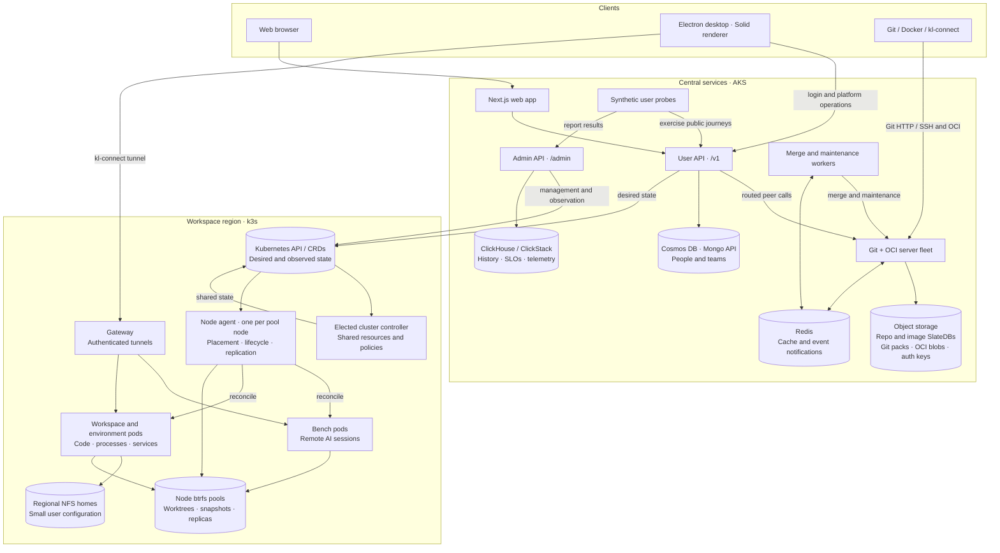
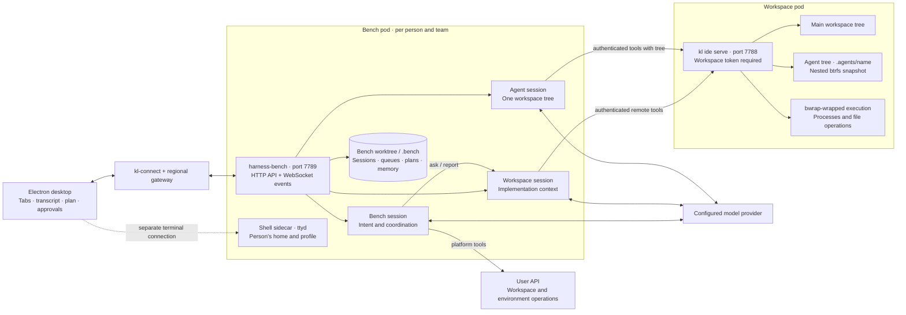
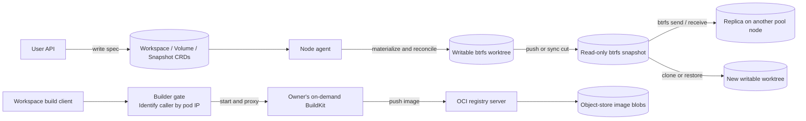
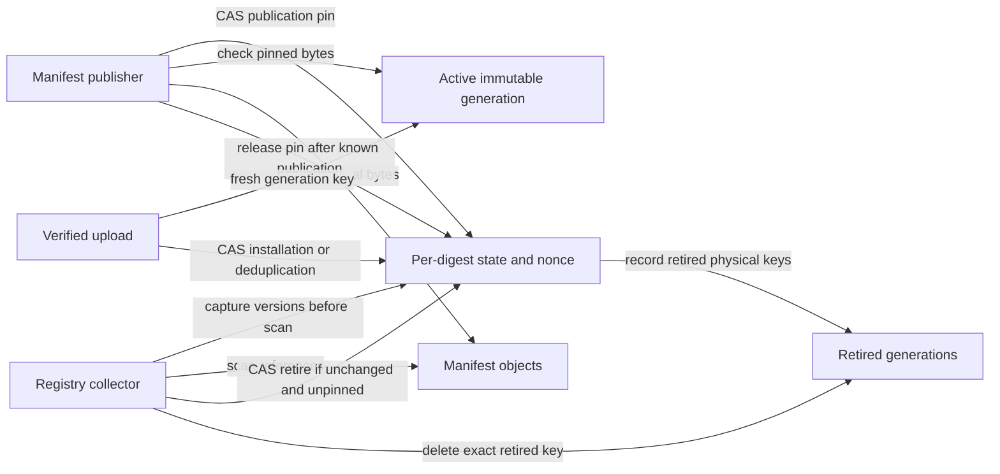

# Kloudlite architecture

[Live review task board](architecture-view/tasks.html)

Source: `desktop-login` at `695f8484`, reviewed 18 September 2026. This describes the code on that branch; it is not a claim that every change is deployed. The last verified fleet image during this session was `858b99ee`.

## Platform overview

The two storage paths are separate. Repositories and registry images use object storage and SlateDB. Workspace snapshots use btrfs and node-to-node replication; they do not pass through the Git server or an object-store snapshot service.

Exactly one server node may open each repository/image database as its writer. Requests route to that owner before touching the database. Kubernetes CRDs are the record for workspace state; Redis is a cache and notification path.

## Desktop, sessions, and tools

All model processes run in the bench runtime, including workspace and agent sessions. A workspace session's tools execute remotely in its workspace. The bench session coordinates work and holds product intent; it has no direct file or execution tools.

The shell sidecar is a separate user surface. Its home-only mounts exclude workspace code and the workspace tool token. It is not the model's execution environment.

State ownership follows four levels: app (connection/team), workspace (files/processes), session (transcript/plan/queue/questions), and tab (open file/scroll/draft).

## Workspace builds and persistence

Pushed snapshots are retained until explicitly deleted; sync points support replication and lifecycle operations. Workspace caches travel with the worktree. Regional NFS homes keep configuration. Agent trees are separate nested subvolumes and are not ordinary files inside the parent's replicated snapshot.

## Source map

| Component | Primary code |
|---|---|
| Web app | `web/apps/web` |
| Desktop | `harness/src` |
| Session runtime, tools and skills | `harness/bench/src`, `harness/pi`, `harness/skills` |
| User/admin API | `bins/api`, `crates/api`, `crates/workspaces/src/api` |
| Git and OCI servers | `bins/server`, `crates/app`, `crates/git`, `crates/gitbase`, `crates/registry`, `crates/storage` |
| Merge and maintenance | `bins/worker`, `crates/pulls` |
| Regional controller and node agents | `bins/controller`, `bins/agent`, `crates/workspaces` |
| Gateway, tool server and build access | `bins/gateway`, `bins/kl-connect`, `crates/ide`, `bins/builder-gate` |
| Probes and history | `bins/slo`, `crates/workspaces/src/history` |
| Deployment | `deploy/kloudlite.yaml`, `deploy/k3s`, `deploy/dev` |

Arrows show principal interactions, not every HTTP request or telemetry export. OpenTelemetry collectors across both clusters send telemetry to ClickStack; the admin process writes the product's history and SLO records. External OAuth, email delivery, package indexes and build caches are omitted from the overview.

## Registry generation hardening

The diagrams above describe baseline `695f8484`. The subsequent hardening work adds an object-store CAS record for each owner/digest and immutable physical blob generations. This is an implementation/migration design, not a statement that the fleet has migrated. Completion evidence lives in the [hardening tracker](review-hardening-2026-09-18.md).

Legacy canonical blobs can be adopted, but an existing state record is authoritative. Reader/writer/collector compatibility and pending operations constrain migration and rollback. Use the proposed [maintenance and recovery procedure](registry-generation-rollout.md); an ordinary mixed-version rolling upgrade is not sufficient.

The current backup inventory is [deploy/BACKUPS.md](../deploy/BACKUPS.md). Workspace data continues to use btrfs replication, independently of this registry change. Generation records and referenced physical bytes must be retained/restored together.
