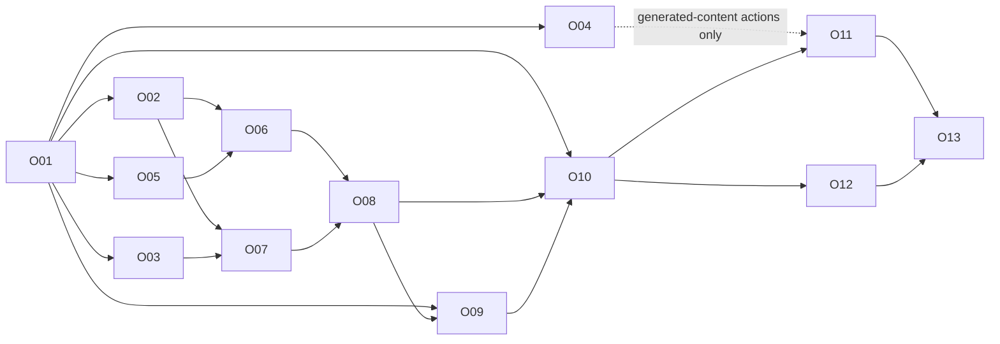

# Harness operation executor — Flash implementation plan

Date: 2026-09-18
Status: Reviewed by Sol; ready for O01; no implementation agents have been launched for this plan
Design: [Harness operation executor specification](../specs/2026-09-18-harness-operation-executor-design.md)
Review record: [Sol findings and resolution](../specs/2026-09-18-harness-operation-executor-review.md)
Capability formats: [Minimal instructions and internal file edits](../specs/2026-09-18-harness-capability-contracts.md)
Planning: Astra
Review: Sol
Implementation: DeepSeek Flash

## 1. Handoff rules

Read the specification first. Its boundaries and acceptance gates are requirements. O01 freezes shared contracts before dependent workers start. Each task gets an isolated branch/worktree from an explicitly recorded integration SHA. The inspected implementation is in `/Volumes/kdisk/rustic-git-wt/desktop-login` at `0bc31e9d`; these documents were written in `/Users/karthik/rustic-git`, a different checkout. Do not develop against stale files merely because they are the current working directory.

This plan authorizes no implementation or production rollout by itself. When implementation begins, the coordinator confirms the active baseline from repository state, transfers these two documents to that branch, and starts the ready tasks. Existing unrelated files, particularly secret manifests and personal settings, stay outside commits.

Use Flash for coding. Use Astra for planning and Sol for contract/final review; do not silently fall back to Luna when Flash is unavailable. If mixed-provider native agents are unavailable, run configured Flash CLI workers and register their actual process/session IDs in the task tracker. Do not claim a native OpenAI worker is Flash. Never place API keys in prompts, source, logs, or taskboard data.

Every task follows implementation → targeted verification → review. Independent tasks can be implemented and verified in parallel; dependent tasks wait for accepted interfaces. One task's review must not serialize unrelated ready work. Keep names/types readable, avoid redundant comments, and retain explanations only where an invariant or protocol would otherwise be unclear.

## 2. Proposed module ownership

Create `harness/bench/src/operations/` for new executor modules. Proposed names below are ownership boundaries; O01 may simplify them while freezing interfaces. Reuse existing durability, tracing, policy, and tool transport instead of making competing copies.

| Owner | New modules | Existing files allowed |
| --- | --- | --- |
| O01/O02 contracts | `contracts.ts`, `capabilities.ts`, `arguments.ts` | `pi/catalog.ts`, contract extraction from `pi/kloudlite.ts` and `pi/workspace-tools.ts` |
| O03 judgments | `judgments.ts`, `typesafe.ts` | Dedicated config wiring through coordinator only |
| O04 generation | `generation.ts` | Dedicated provider integration through coordinator only |
| O05 lifecycle | `store.ts`, `state.ts`, `recovery.ts` | `bench/src/log.ts` only for demonstrated durability gaps |
| O06 execution | `scheduler.ts`, `executor.ts` | Shared handlers through O02 interfaces |
| O07 planning | `recipes.ts`, `resolve.ts` | No edits to O02 contracts without coordination |
| O08 integration | `coordinator.ts`, `pi/operate.ts` | `bench.ts`, `server.ts`, `rpc-child.ts`, extension registration |
| O09 visibility | Operation view/model modules | `bench-client.ts`, renderer event/state/tool/task views |
| O10 evaluation | Replay corpus and runner | Test scripts and evidence docs |

All overlapping existing-file edits go through the named owner. Shared dependency changes and lockfile updates belong to the coordinator. Other workers deliver adapter patches or interface requests instead of editing those files concurrently.

## 3. Task ledger

Initial status for every task is `planned`. Dependencies below are acceptance dependencies; an agent may prepare fixtures against frozen contracts while upstream code is in progress.

### O01 — Freeze contracts and baseline

Depends on: none. Implementer: Flash. Reviewer: Sol.

- Record integration full SHA and compare inspected behavior with current code.
- Define `operate` request/response schemas, context/artifact references, decision/resume schema, operation and step transitions, event envelope, capability contract, argument provenance, provider interfaces, and error taxonomy.
- Freeze the default one-field instruction interface, compact model-facing results, optional guide/schema discovery, internal descriptor schemas, and advanced exact calls. Make the linked simple edit examples executable fixtures; do not require the main model to supply patches, old/new text, or revision tokens.
- Define typed output bindings between steps, state revisions, idempotency identity, schema/question versions, size limits, redaction, and budget defaults.
- Publish fixtures covering start/exact/inspect/resume/cancel, successful reads, ambiguity, unknown mutation outcome, partial completion, and reconnect.
- Define how the trusted actor and current user-turn revision are obtained at the extension/bench boundary. Model-supplied identity is never authoritative.
- Freeze separate user-decision records and additional-input resolutions: the model cannot provide approval values. Bind approvals to actor/session/payload/revision/expiry and define authenticated owner control after session archival.
- Define stable inspect/events/cancel/decision control endpoints independent of feature mode, and one authoritative allowlist covering every runtime activation and dispatch path.

Acceptance: fixtures validate; invalid discriminated-union cases fail; Sol approves the transition table and capability interface. Deliver an interface commit that downstream work can share.

### O02 — Capability contracts and handler parity

Depends on: O01. Implementer: Flash. Reviewer: Sol for mutation semantics.

- Extract a single policy-bearing dispatch adapter used by both legacy calls and the executor, including asynchronous approval. Raw handlers remain inaccessible to the executor; moving a handler out of its current `execute` wrapper must preserve its checks. No bench-local shell access.
- Make schema, effect, scope, required fields, defaults/clear semantics, conflict keys, success evidence, reconciliation support, and approval rendering discoverable from one reviewed contract.
- Supply internal descriptors from that same executable registry with input/output schemas, rules, limits, examples, and errors. Optional describe returns a short guide by default and schema on explicit request; it never calls a model or activates a tool. The executor discovers backend formats internally without a main-model round trip.
- Fix confirmed restore description/handler drift. Encode create-source exclusivity and process-action requirements.
- Specify preservation of existing service configuration and package collections on updates.
- Add an allowlisted initial read capability set and maintain worker/read-only/ephemeral restrictions. Bench process inspection initially reads only its existing process metadata; workspace log/file tools remain unavailable until the scoped deterministic workspace adapter is accepted.

Acceptance: parity cases show the same allowed/refused execution paths as direct tools; the restore preview matches its actual scope; incompatible arguments are rejected before side effects. Catalog text cannot independently redefine semantics.

### O03 — TypeSafe judgment adapter

Depends on: O01. Can run alongside O02, O04, O05.

- Implement a small typed HTTP adapter or evaluate the official SDK against the same interface. Pin dependencies if added.
- Support Choice/Score/Noul; validate types, finite ranges, expected answer IDs, candidate keys, and probability shapes.
- Add cancellation, deadlines, bounded retry with server retry hints, token budgets, and model/question version reporting.
- Read the TypeSafe key from trusted configuration; redact request diagnostics and prevent secrets entering state.
- Add `ambiguous/no_match` support and explicit question instructions that do not rely on question IDs being visible to the model.
- Implement deterministic test fixtures and shadow recording with no real dispatch.

Acceptance: missing/malformed answers, unsupported choices, NaN/range errors, 401/422/429/529, timeout, abort, and model-version changes have explicit outcomes. Unit tests use no live account.

### O04 — Bounded Flash generation adapter

Depends on: O01. Can run alongside O02, O03, O05.

- Implement configured Flash requests for bounded content tasks with output schemas and per-request budgets.
- For instruction-driven edits, the executor reads scoped source, Flash proposes content/replacements, and code calculates the diff. The main model supplies only the intended change; it must not be asked to format ordinary patches.
- Enforce trusted provider-input policy before sending source: read access alone is insufficient. Disallowed/unclassified or secret-bearing input must not reach any model, retry log, or trace; use an applicable deterministic path or report the limitation without a write. Include secret-bearing fixtures; model redaction is not a control.
- Separate missing facts from generatable content using a typed request role.
- Deny recursive tool use, hidden premium-model escalation, and credential forwarding.
- Support exact user/main-agent artifacts without regeneration and verify digest/size at use.

Acceptance: a missing port or unknown snapshot yields a discovery/decision requirement; a permitted query/command draft yields proposed content only. Invalid output and provider failure do not execute anything. Exact patch bytes remain unchanged.

### O05 — Durable operations and recovery

Depends on: O01. Can run alongside O02–O04.

- Implement durable acceptance, append/replay, monotonic events, request deduplication, request revisions, stable step IDs, and budget persistence.
- Audit initial-file durability and torn-tail versus interior corruption behavior before reusing `log.ts`.
- Persist intent before dispatch; support recorded backend operation identity and action-specific reconciliation.
- Implement resume revision checks, approval invalidation, cancellation, expiry, and restart ownership rules.
- Define storage retention/compaction without losing evidence required for active-operation recovery.

Acceptance: fault-injection tests cover crash before acknowledgment, after dispatch/before result, after committed mutation, duplicate delivery, changed body with same key, reconnect, stale resume, and corrupt log records. No test claims exactly-once behavior for a backend lacking it.

### O06 — Scheduler and execution engine

Depends on: O01, O02, O05.

- Validate DAGs and bind dependency outputs through typed references.
- Implement fair per-operation/global concurrency, resource conflict lanes, deadlines, abort propagation, and step events.
- Serialize package/service collection updates and unknown command footprints.
- Execute through O02 adapters, preserve authorization, and reconcile unknown effects before retries.
- Aggregate observed results into completed/partial/failed states without automatic generic rollback.

Acceptance: barriers prove independent reads overlap; dependency and shared-resource tests prove conflicting calls never overlap; partial mutations and cancellations report exact completed effects. Test external version conflicts and exclusive bench ownership assumptions.

### O07 — Candidate resolution and bounded recipes

Depends on: O01, O02, O03. Recipe execution additionally depends on O06. O04 is required only for later recipes that explicitly generate content; initial read recipes must work without it.

- Implement deterministic literal/ID resolution and scoped candidate discovery before model selection.
- Ship initial recipes for workspace lookup/progress, bench-owned process metadata, and tool/skill discovery. Do not fetch workspace logs or satisfy a recipe by issuing an open-ended ask to a workspace agent.
- Add known/unspecified/clear/ambiguous/unsupported argument states and per-field provenance.
- Select valid tuples for dependent arguments; split calls when choices require newly fetched data.
- Constrain plan expansion to recipe limits. Return unsupported workflows to the main agent.

Acceptance: duplicate names, absent candidates, stale resources, typos, negation, missing referents, and cross-tenant references produce correct bounded results. No failure is repaired by inventing a resource. Dependent questions do not consume nonexistent same-request answers.

### O08 — Single-tool integration and policy bridge

Depends on: O02, O05, O06, O07. Own all shared bench/extension integration edits.

- Register only `operate` for opted-in main sessions and keep built-in tools disabled. Apply one allowlist to registration, all `setActiveTools` paths, remembered discovery, plan-mode toggles, runtime listings, and dispatch.
- Implement authenticated operation endpoints and actor/context binding using existing identity mechanisms.
- Bridge approvals/questions to the original session UI with concrete immutable arguments; preserve existing accept-edits and other configured policy behavior. Only authenticated user UI or the trusted policy adapter can record grant/denial. Model resume may reference a recorded decision and cannot supply a grant value.
- Wire live events, background result delivery, inspect/resume/cancel, lifecycle/idle handling, and tracing.
- Add disabled/shadow/assisted/single-tool modes with safe in-flight transitions. Keep authenticated inspection/events/cancel/decision endpoints and desktop controls available regardless of mode; preserve owner access after session archival and reject archived-model resume.
- Preserve existing workspace asks, worker tools, read-only forks, and ephemeral restrictions.

Acceptance: runtime registration inspection demonstrates one tool after restart with remembered discoveries, plan-mode toggles, and attempted direct internal-tool invocation. Exact mode cannot bypass approval; forged `resume yes` and replayed decision records fail; operation ID knowledge does not grant access. Disable mid-flight and restart, then inspect/cancel through the authenticated UI with both providers unavailable and the original session archived.

### O09 — Visible operations and taskboard

Depends on: O01 fixtures; integrate after O05/O08 events exist. Can implement UI against fixtures earlier.

- Add expandable operation details with steps, dependencies, concurrent calls, target workspace/tree, model, elapsed time, usage, queue reason, evidence, and errors.
- Present concrete approval content and unresolved decisions without requiring users to inspect logs.
- Replay events by sequence after reconnect; resync snapshots when necessary.
- Project task/agent progress from durable events and distinguish failed/cancelled/partial/unknown from completed.

Acceptance: fixtures and one live integration demonstrate running parallel steps, queued dependencies, provider outage, needs-input, cancellation, partial completion, and reload recovery. No synthetic progress percentages or model-invented success.

### O10 — Replay evaluation and read-only pilot

Depends on: O01 for corpus; O03/O07/O08/O09 for pilot.

- Build a sanitized corpus from representative harness situations with independent expected actions and arguments.
- Separate tuning and held-out cases; record original authorized intent and relevant state.
- Compare current behavior, deterministic baseline, and proposed executor on the specification's metrics.
- Run shadow first; never duplicate mutations while comparing approaches.
- Live provider calls require configured TypeSafe credentials and an explicit evaluation budget. Missing credentials do not block deterministic or mocked tests.
- Publish whole-call errors, abstentions, candidate misses, latency, usage, and limitations.

Acceptance: all mechanical gates pass; Sol reviews held-out failures and chooses task-specific thresholds. Read-only single-tool enablement requires a recorded rollout decision, not simply a high average score. No fabricated benchmark numbers.

### O11 — Scoped workspace execution and bounded mutation pilot

Depends on: accepted O10, O02 mutation contracts, O05 recovery, O06 scheduling.

O04 is additionally required only for generated-content actions. Deterministic mutations and exact provided content must not depend on a generation provider.

Instruction-driven file edits explicitly require O04; measure main-model and executor tokens separately. One short instruction must complete without main-model patch construction or a schema-discovery round trip.

- Add the deterministic workspace adapter before enabling process logs, file operations, or workspace commands. Carry trusted workspace/tree/session scope and a bounded exact step envelope through the existing tool-server transport and policy-bearing dispatch. Preserve delegation ownership; never run the operation on the bench or start an unrestricted agent to satisfy a recipe.
- Before file editing, implement the linked raw-text read/revision snapshot and exact-replacement contract at the tool-server boundary. Audit coordinated writers and preserve file metadata; do not claim external-writer CAS or cross-file transactions. If backend changes are needed, give the Rust tool-server work a separate scoped owner and pod test lane. Existing numbered read output and blind edit APIs do not satisfy this contract.
- Prove no second LLM session is spawned for workspace recipe steps; explicit agent delegation is a separate visible capability with its own lifecycle.
- Add workspace clone/create, package updates, and explicitly supported process actions in disposable integration fixtures.
- Add per-capability flags; intercept/environment restore remain disabled until their semantic and reconciliation tests pass.
- Exercise timeout-after-commit, collection replacement, approval binding, exact content, stale target, and partial parallel success.
- Revalidate real backend conflict behavior rather than relying only on in-memory locks.

Acceptance: no unresolved effect is silently retried; no optional uncertainty becomes destructive omission; preview and executed payload agree. Keep canary scope narrow until Sol accepts its evidence.

### O12 — Semantic extensions

Depends on: O10. Each subtask can have a separate Flash owner and flag.

- O12a: queue ordering and message/reference classification; add explicit origin metadata, fairness, and no-loss/user-order invariants.
- O12b: waiting-state and clarification judgments; use for nudges only and preserve explicit approvals/preferences.
- O12c: memory admission, relevance, conflict signals, and context ranking; mandatory instructions never filtered out.
- O12d: failure triage, stalled-work signals, and report filtering; use observed process/attempt data and retain full evidence references.
- O12e: delegation/model recommendations, review prioritization, final-claim support checks, and offline failure categorization; preserve main-agent decisions and mandatory review gates.

Acceptance: each extension has a held-out task-specific evaluation against its current heuristic and documented false-positive behavior. An extension that does not improve quality or total time remains disabled. None can mark a test/deployment successful or grant new access.

### O13 — Integration, review, and release handoff

Depends on: the selected release scope, O10, and applicable O11/O12 subtasks.

- Integrate accepted commits in dependency order; run the exact integrated SHA's required gates.
- Sol reviews the complete call path, recovery model, authorization parity, secret boundaries, and rollout evidence.
- Document enabled capabilities, feature modes, provider configuration names, measured limits, known exclusions, and operator recovery steps.
- Produce a concrete release candidate and rollback/disable procedure. Deployment is a separate authorized action; switching the feature off must preserve inspect/cancel for existing operations.

Acceptance: no unresolved critical review findings; all declared release-scope checks have evidence; UI and taskboard reflect actual completion. Do not label deferred capabilities implemented.

## 4. Parallel work schedule



The diagram shows integration dependencies; O09 fixtures and O10 corpus preparation start after O01. O13 can release the read-only slice after O10 without waiting for disabled mutation/extension work. Scope must be named explicitly.

With three worker slots plus the coordinator:

1. Freeze O01 with Sol review.
2. Run O02, O03, O05 in parallel. Fill the next free slot with ready O06/O07 work, O09 fixtures, or O10 corpus work. O04 may use spare capacity but does not block the read-only pilot.
3. Start O06 once O02/O05 land, and O07 once O02/O03 land. Continue O09 and O10 independent preparation.
4. Integrate O08, then validate O09/O10 against it. Review accepted slices while other workers continue.
5. After pilot acceptance, run independent O11/O12 slices within their ownership boundaries.

Available slots and provider rate limits determine actual concurrency. Do not start competing workers on the same shared file to make the taskboard look busy.

## 5. Verification infrastructure and progress

Use the existing dev-pod test infrastructure when available. Resolve current pod names and mounted paths at execution time; old pod names are not a contract. Do not modify production resources while testing this executor.

- Give each concurrent test lane an isolated checkout/artifact directory, temporary bench folder, and unique fixture port allocation.
- Run targeted Node tests in parallel for independent modules. Start with concurrency 4 per lane only if the combined load fits the pod; enforce a global cap.
- Run renderer typecheck/build and UI integration separately from backend tests where independent.
- If a Rust/backend change becomes necessary, use distinct `CARGO_TARGET_DIR` values on the allocated pod/storage and coordinate disk capacity. This plan is primarily TypeScript; do not add Rust work without a concrete dependency.
- Inspect actual test summaries and exit codes. PM2 stopped/online status alone is not evidence of passing tests.
- Run one integrated harness regression suite at the accepted SHA, plus meaningful recovery/security/concurrency tests. Repeat only to resolve a failure, changed risk, or release gate.
- Register test jobs in the existing visible process monitor if it is still the project's runner. Reflect external CLI workers and Kubernetes Jobs accurately in the taskboard; do not imply they are native agents.

Every task record must expose: owner/provider/model, branch and base SHA, current stage, last meaningful activity, process/job ID, test counts and evidence paths, review findings, blocker, and next action. Stages are `planned`, `ready`, `implementing`, `testing`, `review`, `changes_requested`, `verified`, and `blocked`. A queued task states its dependency. A blocked task states the exact missing input or external condition. Track implementation-agent work separately from internal executor steps.

## 6. Flash task prompt template

```text
Implement task Oxx from docs/superpowers/plans/2026-09-18-harness-operation-executor.md.
Read its linked specification and frozen O01 interfaces first.
Model: configured DeepSeek Flash. Worktree: <isolated path>. Base SHA: <full SHA>.
Allowed files: <owned paths>. Shared files belong to <integration owner>.
Deliver the task's stated behavior and acceptance cases. Preserve existing policy and scope.
Do not change contracts, install unrelated dependencies, call live paid APIs, or deploy.
If blocked, report the exact missing interface/input and continue independent owned work.
Return changed files, commit SHA, executed verification and actual results, remaining risks,
and any planning decision needed from Astra or review decision needed from Sol. Never include credentials in output.
```

## 7. Required adversarial and recovery cases

The integrated evidence must cover at least:

1. Duplicate resource names; exact ID match; no candidate; incomplete candidate shortlist.
2. Corrected user target while selection is in flight; superseded approval and stale resume.
3. Repo/branch mismatch; snapshot/repo exclusivity; action-dependent process fields.
4. Intercept set/clear/unspecified; omitted service settings; package repinning with unrelated packages preserved.
5. Prompt injection in logs/resource labels; unauthorized context/artifact references; secret redaction.
6. Provider timeout, invalid response, overload, cancellation, and unknown model version.
7. Parallel independent reads; serialized collection writes; unknown shell footprint; fair scheduling.
8. Crash after mutation commit but before result recording; duplicate tool delivery; backend reconciliation unavailable.
9. Cancellation after partial completion; bounded waits; persisted budgets; no unrequested rollback.
10. Restart/reconnect/feature disable with active operations; accurate UI terminal states and evidence.
11. One-tool runtime surface; exact path cannot bypass policy; bench has no local shell; read-only fork cannot mutate.
12. Same request key with conflicting body; operation ID from another session/tenant; replayed decision response.
13. Model-forged approval; additional-input payload trying to resolve a user-only decision; changed payload after approval.
14. Feature disable plus restart with active operations; archived-session owner controls; old remembered tools and plan-mode toggles attempting to escape the single-tool allowlist.
15. Bench pilot process inspection cannot invoke workspace tools; later exact workspace steps retain scope/path policy and spawn no hidden LLM session.

These cases verify real invariants. Avoid tests that only repeat implementation constants or mock away authorization and recovery boundaries.
