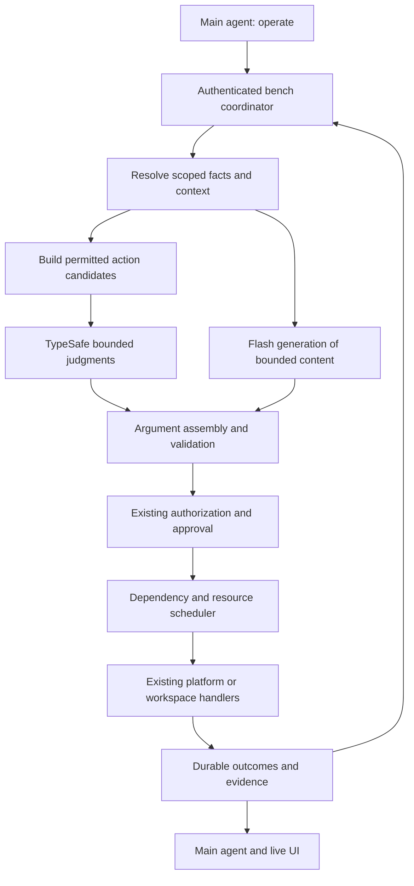

# Harness operation executor

Date: 2026-09-18
Status: Reviewed by Sol; O01 contract implementation in progress
Audience: Flash implementation agents, Astra planners, Sol reviewers, harness maintainers
Implementation plan: [Agent work plan](../plans/2026-09-18-harness-operation-executor.md)
Review record: [Sol findings and resolution](2026-09-18-harness-operation-executor-review.md)
Capability protocol: [Simple instructions and internal file-edit format](2026-09-18-harness-capability-contracts.md)

## 1. Purpose and decisions

Expose one tool, `operate`, to the main agent. Behind it, the harness resolves resources, selects capabilities and arguments, generates bounded new content when required, and executes independent steps concurrently. The main agent owns the overall objective, difficult reasoning, tradeoffs, and communication with the person. The executor owns the mechanics of a bounded operation.

The following decisions come from the discussion:

- TypeSafe Jev supplies bounded semantic judgments: Choice, Score, and Noul.
- DeepSeek Flash supplies limited generative work. Explicit model choices remain authoritative; there is no silent substitution with Luna or a premium model.
- Code supplies exact facts, validation, authorization, scheduling, deadlines, persistence, and evidence of completion.
- An exact proposed action can bypass semantic selection. TypeSafe is optional when code already has an unambiguous answer.
- One public tool must support starting, inspecting, continuing, and cancelling work. Internal calls remain visible in the UI.
- Parallelism is based on dependencies and shared resources, with independent reads as the first use case.
- The executor cannot invent missing facts, reinterpret approval, create an unrestricted recursive agent, or claim success without execution evidence.
- Sol reviews contracts and integration; Flash implements bounded tasks in isolated branches/worktrees.

This document specifies the architecture and eventual extensions. The first release covers discovery, resource resolution, bounded read operations, and shadow evaluation. Mutations and generated commands are later gated stages. This task creates documents only; it does not install TypeSafe, provision credentials, run paid evaluations, or deploy the executor.

## 2. Evidence and implementation baseline

Code was inspected in `/Volumes/kdisk/rustic-git-wt/desktop-login`, HEAD `0bc31e9d`, whose application release source is `05f63c0214fd49cbdbf027250c20b44d61d9555e`. Documents live in the shared checkout `/Users/karthik/rustic-git`. That checkout is a different branch and must not be assumed to contain the inspected implementation. Before implementation, resolve the intended integration branch, record its full SHA, and check these contracts against that revision.

Relevant integration points, relative to the implementation checkout:

| Existing file | Current responsibility | Proposed integration |
| --- | --- | --- |
| `harness/pi/catalog.ts` | Tool descriptions, effects, approval text | Shared executable capability contracts |
| `harness/pi/kloudlite.ts` | Platform tools, ask/report, resource resolution, memory, skill discovery | Internal adapters and `operate` extension |
| `harness/pi/workspace-tools.ts` | Workspace file/process tools, confinement and approval | Reuse handlers through the same checks |
| `harness/bench/src/rpc-child.ts` | Model child startup, session tool surface | Single-tool mode and capability inheritance |
| `harness/bench/src/bench.ts` | Session orchestration, triage, asks, process events | Operation coordinator and event delivery |
| `harness/bench/src/server.ts` | Bench API | Authenticated operation transport |
| `harness/bench/src/log.ts` | Durable append and JSON replacement | Storage primitives, subject to recovery audit |
| `harness/bench/src/ledger.ts` | Tasks, processes, plans | Projections from operation events |
| `harness/bench/src/exchanges.ts`, `exchange-state.ts` | Ask history and state | Links to operation/step IDs; preserve existing behavior |
| `harness/bench/src/triage.ts`, `plan.ts`, `memory.ts` | Semantic heuristics and persistence | Later advisory judgment integrations |
| `harness/src/renderer/components/ToolCall.tsx`, `inspector/Tasks.tsx` | User-visible progress | Expandable operation and step details |

Observed prerequisites, to reproduce before changing code:

1. `catalog.ts` describes `kl_environment_restore` as creating a new environment with `snapshot_id/name`; `kloudlite.ts` registers an in-place restore with `id/snapshot`. Align descriptions, schema, approval text, and handler semantics.
2. Workspace creation accepts `repo/branch` alongside `from_snapshot`, but snapshot selection supersedes repo creation. Encode mutually exclusive creation modes.
3. Intercept omission is meaningful: no workspace clears the intercept; no ports uses the existing one-to-one mapping behavior. Uncertainty must not become omission.
4. Process action schemas have action-dependent requirements. Validate the action and its required fields together.
5. Package and environment-service updates can read and replace an entire collection. Different items may still share a write conflict.
6. Existing service replacement defaults may erase omitted settings. Define preservation versus replacement explicitly.
7. Queue provenance currently uses a leading `[` heuristic. Add explicit origin metadata before allowing model judgments to distinguish people from system/agent reports.
8. Receipt of an agent answer is not evidence that its assigned work succeeded. Operation completion must derive from typed execution outcomes.

## 3. TypeSafe capabilities and limits

Documented primitives:

- Choice selects one supplied option, with probabilities and confidence.
- Score evaluates an ordered rubric; it does not generate an exact number such as a port or timeout.
- Noul estimates a yes/no proposition and has no separate confidence field.
- Questions in one request share state but cannot consume each other's answers. Fetch-dependent questions require another stage.

The function-calling cookbook demonstrates selecting tools and closed-set arguments. This supports candidate selection; it does not establish correctness on our tools. Confidence thresholds, latency, and cost savings must be evaluated on harness workloads. Jev is text-only, and its documented limitations include adversarial state and distraction from irrelevant context. Model confidence is not an authorization signal.

Initial model pin proposed for evaluation: `jev-1.13.0`, subject to an availability check at implementation time. Record the resolved version and question version on every judgment. Do not use an automatically moving alias for a calibrated production policy.

Sources, consulted 2026-09-18:

- [Introduction](https://docs.typesafe.ai/introduction)
- [Primitives and dependencies](https://docs.typesafe.ai/primitives)
- [Function calling](https://docs.typesafe.ai/cookbooks/function_calling)
- [Skill selection](https://docs.typesafe.ai/cookbooks/skill_suggestion)
- [Confidence](https://docs.typesafe.ai/confidence)
- [Model limitations](https://docs.typesafe.ai/model-jaggedness/jev-1.13)
- [API](https://docs.typesafe.ai/api)
- [Models](https://docs.typesafe.ai/models)

Provider performance and sample results are vendor claims, not measured harness results. Pricing and limits are intentionally not deployment assumptions.

## 4. Architecture and trust boundaries



The coordinator runs in the bench. Actual workspace execution remains in the appropriate workspace/tree. A bench request must not acquire a local shell or bypass the existing ask/ownership boundary. Preserve read-only forks, ephemeral agent restrictions, workspace confinement, and capability inheritance. Exact requests are subject to these same restrictions.

The initial bench pilot can inspect bench-owned process metadata, but cannot directly read workspace process logs or execute workspace tools. Those require a later deterministic workspace adapter. That adapter must resolve trusted workspace/tree/session scope, carry a bounded exact step envelope to the workspace tool server, use the same path checks and policy-bearing dispatch, and return structured outcomes. It cannot implement a step by sending an open-ended `ask` to an unrestricted workspace agent. An explicit user/main-agent delegation request remains a separate visible operation with its own agent budget and lifecycle. Tests must prove ordinary executor recipe steps spawn no second LLM session.

Extract shared handlers from extension registration where needed. Both legacy tool invocation and the executor must use one policy-bearing dispatch adapter. That adapter performs scope/path checks, obtains the applicable approval, binds its payload digest, and only then invokes the handler. The executor must not call raw handler functions: current checks live partly inside extension `execute` wrappers, so moving only the handler would bypass them. Parity tests must exercise the real dispatch entrypoint, including asynchronous approval and read-only/worker restrictions. Keep credentials in the existing trusted execution context; neither Jev nor Flash receives API keys, bearer tokens, or privileged environment values.

Each operation uses authoritative session identity, current request revision, capability scope, and execution policy supplied by the harness. Fields supplied by the model may narrow scope but cannot expand it. Preserve original user messages through authorized references rather than trusting a model-written `user_request` as permission.

## 5. One public tool

The common `operate` call is a single instruction, for example `{"instruction":"In src/config.ts, change the timeout to 30000."}`. The executor reads source and calculates patches internally. The main model does not supply revision tokens or replacement blocks for routine edits. Use the following union for common requests and explicit control/advanced requests; O01 freezes its executable schema before parallel implementation.

```ts
type OperateRequest =
  | IntentRequest
  | { action: "describe"; capability?: string; cursor?: string;
      detail?: "guide" | "schema" }
  | { action: "exact"; request: ExactRequest }
  | { action: "inspect"; operationId: string; afterSequence?: number }
  | { action: "resume"; operationId: string; decisionId: string;
      expectedRevision: number; resolution: DecisionResolution }
  | { action: "cancel"; operationId: string };

type IntentRequest = {
  instruction: string;
  contextRefs?: ContextRef[];
  inputs?: Record<string, JsonValue>;
  constraints?: string[];
  expectedResults?: string[];
};

type ExactRequest = {
  objective: string;
  contextRefs?: ContextRef[];
  calls: ExactCall[];
};

type ExactCall = {
  key: string;
  capability: string;
  capabilityVersion: string;
  targetRef?: string;
  args: Record<string, JsonValue>;
  dependsOn?: string[];
};

type DecisionResolution =
  | { kind: "recorded_user_decision"; recordId: string }
  | { kind: "additional_input"; inputs: Record<string, JsonValue>;
      contextRefs: ContextRef[] };
```

`JsonValue`, `ContextRef`, and `DecisionResolution` become validated shared types in O01, with size limits. Context references name authorized messages, operation evidence, or workspace artifacts; they never mean arbitrary local paths, URLs, or cross-tenant object access. Exact argument objects support artifact references for large patches/content with digest verification. They cannot set effect, permission, lock scope, or trusted actor identity.

There are two distinct pending-decision classes: user authorization/preference and additional factual/content input. User decisions are recorded only through the authenticated user UI bridge; applicable automatic approval policy is recorded only by the trusted policy adapter. An approval record binds actor, tenant, session, operation/step, canonical payload digest, revision, policy source, expiry, and grant/denial. `resume` may reference that record but cannot supply or change the grant. `additional_input` cannot resolve a user-decision requirement, and its claimed facts must retain provenance and pass validation. Fabricated record IDs, expired decisions, cross-session grants, and replayed resolutions are rejected. Model calls cannot forge approval by submitting `yes` as text or a boolean.

Expose a short instruction guide and examples in `operate`'s description. The executor reads the internal capability contracts automatically. Optional deterministic `describe` returns a concise guide by default and full versioned schemas only with `detail: "schema"`, without activating extra tools. Advanced exact calls pin `capabilityVersion`; target-requiring capabilities validate their opaque `targetRef`. The linked protocol specifies minimal editing instructions, internal diff calculation, and guarded writes. A broad unsupported goal returns `needs_input` or `unsupported`, with what is missing; it does not trigger unlimited autonomous exploration. The model may supply already-authored exact content when useful, but routine editing requires no patch-format knowledge.

The tool transports cancellation and inspection even during model/provider outages. Ordinary chat remains available for communication. Questions and approvals use the existing UI through a coordinator decision bridge; neither requires a second model-visible tool.

Authenticated operation inspection, event, cancellation, and decision endpoints are a durable control API that remains enabled independently of the AI/registration feature mode. The desktop retains operation controls after the mode is disabled or the originating session is archived. The authenticated operation owner can inspect/cancel via these controls after session archival; model credentials from an archived session cannot resume work. Tenant membership/ownership revocation follows current authorization and requires an authorized operator recovery path. Disabling removes new single-tool routing on a safe session transition, restores the legacy model surface, and leaves existing operations observable/cancellable through the control API. Do not depend on an unregistered model tool for recovery.

Initially enable single-tool registration only for opted-in main sessions. Worker and read-only session tool surfaces retain their existing restrictions until separately migrated. One authoritative mode-aware allowlist must govern extension registration, built-in startup flags, all `setActiveTools` calls, remembered discovery restoration, plan-mode toggles, runtime listings, and invocation dispatch. For single-tool main sessions its sole entry is `operate`. Loading an old session with remembered tools cannot re-enable them. Validate the actual runtime surface and rejection of direct internal-tool calls, not only `RpcChild.tools()`'s computed list.

## 6. Argument assembly

Each argument carries internal provenance, separate from the final tool payload:

| Source | Example | Rule |
| --- | --- | --- |
| User value | New name, explicitly supplied port | Preserve exact value; validate format and range |
| Runtime fact | Owner, region, process cursor, allocated port | Obtain deterministically; never predict |
| Resource candidate | Workspace, repo, branch, snapshot, agent | Choose only from current permitted candidates |
| Enum | Merge method, process action, delegation mode | Select a supported option or abstain |
| Set | Package bundle, selected files | Assemble memberships; validate cardinality and compatibility |
| Generated content | Search query, command, patch, brief | Bounded generation, validation, normal authorization |

Internal value states are `known(value)`, `unspecified`, `explicitly_clear`, `ambiguous`, and `unsupported`. Preserve distinctions between missing, false, null, empty, and clearing. Defaults are permitted only when the capability explicitly defines them and the request does not contradict them.

Candidate generation runs exact matching and code filters first. Explicit IDs and unambiguous literal values need no model. Candidate IDs resolve through a server-owned map to immutable resource identity and observed version. Supply human-readable scope and intent alongside opaque IDs. Always allow `no_match` and `ambiguous`; high confidence among incomplete choices is not proof of a valid answer.

For coupled fields, choose a complete prevalidated tuple or execute a dependent selection stage. Examples: repository then its branches; environment with one of its services; snapshot with a compatible target. Do not take the Cartesian product of every resource when a staged query is smaller and clearer.

Before execution validate schema, required fields, mutually exclusive modes, relationships, permissions, current resource state, and artifact integrity. Revalidation must detect stale selection or changed request revisions. Do not silently substitute another resource.

### Worked requests

- Clone backend as `backend-debug`: resolve source from permitted workspaces; copy name from request; invoke existing clone handler.
- Inspect failed build: the pilot resolves bench-owned process metadata and returns observed status; full logs require the later scoped workspace adapter. Once enabled, select the process and read logs/status concurrently where supported, without spawning another agent.
- Install Rust tooling: select a verified package bundle; preserve unrelated installed packages; serialize the workspace package update.
- Intercept payments: select an environment/service/workspace/mapping tuple; explicitly represent set versus clear; verify space-wide effects.
- Ask existing reviewer for another pass: choose a live agent and preserve its context; copy task intent; do not accidentally create a fresh agent.
- Edit a function: main agent supplies a short instruction; the executor reads source, obtains a bounded Flash proposal when needed, computes the diff, and applies through existing edit policy. Already-authored exact content remains an optional advanced input.

## 7. Bounded planning and model use

The first executor supports registered operation recipes, such as inspect workspace, inspect bench-owned process metadata, and resource lookup. Full workspace logs/file reads are disabled until the scoped deterministic adapter is implemented and reviewed. Recipes define read dependencies and success evidence. TypeSafe fills semantic choices within these recipes. Novel workflows return to the main agent, which can submit a bounded exact DAG within enabled capabilities. No free-running inner planner in the first release.

Read-only pilot recipes require no generative-model adapter. Keep generation an optional interface returning `unsupported` when unavailable; O04 is required only for a capability that explicitly generates content. Exact provided content requires validation but no generation provider. Flash coding workers are separate from this optional runtime dependency.

Later generation requests have a role, input references, output schema, size/token/time budget, and permitted purpose. Flash has no direct tools or credentials for this role. It returns proposed content. A generator cannot expand the operation's objective or call `operate` recursively. Complex code and architectural decisions return to the main agent.

If a model is unavailable or output is invalid: retry at most within the bounded policy, use an explicit deterministic fallback where it is equivalent, or return the unresolved decision. Never promote a guess to a fact. Do not silently replace the requested model. Unknown resource data triggers discovery, not generation.

Initial configurable ceilings proposed for the pilot: 12 steps, 3 selection rounds, 2 generation calls per operation, 4 concurrent reads, 2 concurrent mutations on disjoint declared resources, and a 10-minute operation deadline. Provider calls have bounded timeouts; the tool yields an operation handle within 2 seconds after durable acceptance. These are starting policy values, not measured performance claims. Longer work must use an explicit recipe budget and remain cancellable. Awaiting user input releases workers and has a persisted expiry; it never holds a lock indefinitely.

## 8. Parallel scheduling

Each step has dependencies, input bindings, effect, resource keys, deadline, retry class, and required evidence. These come from capability contracts and runtime resolution, not model assertions. Validate acyclic graphs and reject unresolved bindings.

- Run independent reads concurrently within the configured limit.
- Start a step only after required dependencies succeed and output bindings validate.
- Enforce read/write conflict policies against a coherent resource snapshot where necessary.
- Serialize writes to the same workspace package collection or environment service collection.
- Account for tree, build directory, port allocation, repository, environment routing, database, and other shared resources. Distinct file names alone do not prove independence.
- Unknown shell-command footprint takes an exclusive workspace/tree execution lane in the initial implementation. Cross-workspace effects require declared capabilities; the classifier cannot certify them away.
- Provide fair scheduling across operations, bounded queues, cancellation, and explicit reasons for queued steps.
- Use the existing single bench owner plus adapter/backend concurrency controls. In-memory locks do not claim protection from other benches or actors. Use backend conditional updates where available; otherwise restrict unsupported concurrent mutations.

Fail-fast stops dependent work. Independent work may finish under the recipe's declared policy. Parallel mutations are not a transaction. Automatic compensation is permitted only for an explicit tested inverse and its own authorization; no generic rollback promise.

## 9. Durable lifecycle and recovery

Operation states: `accepted`, `resolving`, `awaiting_approval`, `running`, `needs_input`, `reconciling`, `cancel_requested`, `completed`, `partial`, `failed`, `cancelled`, `expired`. Step states additionally distinguish queued, skipped, and outcome unknown. O01 defines the complete transition table and terminal conditions.

`partial` means completed effects remain alongside work that failed, was cancelled, or could not proceed. It does not hide in-flight mutations with unknown outcomes. Preserve `reconciling` until an authoritative result is known or explicitly report unresolved outcome requiring intervention. Do not convert an unknown write into `failed` and retry it blindly.

Persist acceptance before returning an operation ID. Derive a stable deduplication key from authenticated session/turn/tool-call identity. Store canonical request digest and revision: same key/same request returns the same operation; same key/different request is rejected. Different tool-call IDs are not automatically duplicates; detect suspected repetition without suppressing a deliberate repeat.

Persist step intent before dispatch and outcome/evidence afterward. Stable step IDs and backend idempotency keys are used where supported. An operation ID alone does not provide exactly-once effects. A crash between dispatch and recording its result requires reconciliation, using backend operation IDs and preconditions where available. Never use fuzzy name matching as proof that a mutation already happened.

Audit `log.ts` behavior before reuse: durable initial file creation, fsync ordering, torn-tail handling, corruption detection, ownership, sequence numbers, and snapshot compaction. A malformed interior record cannot silently disappear from operation history. Recovery obtains the bench's existing exclusive ownership before dispatching work and reconciles prior running steps before scheduling dependents.

Cancellation stops queued work, propagates abort to running work where supported, and reports committed effects. Resume is restricted to a pending decision ID and expected revision; it cannot replay completed mutations. A changed target/content invalidates previous approval for the changed steps.

Operation deadlines, generation budgets, and attempt counts survive restarts. Approval waits are visible and expire according to policy. Reconnection never creates a fresh operation merely because the UI missed an event.

## 10. Result and visibility contract

The durable operation record and inspection API include `operationId`, `revision`, `state`, last event sequence, completed results, pending steps, failures, unknown outcomes, and evidence references. Default main-model responses contain a compact operation ID/state/summary/evidence view, plus necessary error or decision details. Do not echo internal schemas, source, or patches after routine success. A `needs_input` response includes a specific decision ID and missing information. Public errors distinguish unsupported request, ambiguous target, missing fact, permission denied, validation failure, provider failure, execution failure, and unknown outcome.

An operation event contains operation/step IDs, monotonic sequence, timestamp, phase, capability, redacted argument preview, model/version if applicable, concise decision code, dependencies, queue reason, timing, retry count, and evidence references. Do not request, store, or expose private chain-of-thought. A selected candidate and an uncertainty measure are sufficient decision metadata.

Display an expandable operation under the main tool call:

- All internal steps, running count, queue reasons, and dependencies.
- Actual workspace/tree and model/provider when used.
- Approval preview with concrete target, content, and scope.
- Progress from execution events, including background process IDs.
- Partial results, cancellation state, and failed/unknown steps.
- Usage and elapsed time; cost estimates only when a versioned price source exists.

Support event replay after a cursor and snapshot resync when history is compacted. UI state is a projection of the operation log. Taskboard counts, agent progress, and final claims must not be independently invented by a model. Preserve distinct terminal outcomes in new operation UI even if legacy exchange views flatten them.

Store full sensitive arguments only when required for recovery in the authorized private operation store. Redact prompts/events/telemetry, use artifact references, cap retention and result sizes, and never send secrets to classification or generation providers. Log the approved argument digest so execution can verify it is unchanged.

## 11. Complete opportunity map

All discussed applications are captured here. A semantic judgment is advisory unless the corresponding code policy explicitly permits it to affect a reversible decision.

| Area | Candidate judgment | Boundary / delivery stage |
| --- | --- | --- |
| Incoming message | Status, correction, new task, follow-up, cancellation | Never replace the objective or cancel solely from a classifier; extension stage |
| References | Resolve “that workspace” or “the second option” | Ground in authorized context and preserve ambiguity; pilot |
| Queue triage | Which report unblocks current work | Explicit origins, user order, no loss, age-based fairness; extension stage |
| Tool/skill discovery | Rank supported capabilities and relevant skills | Only registered scoped capabilities; pilot |
| Context selection | Relevant files, logs, memories, decisions | Preserve mandatory constraints; retrieve before ranking; extension stage |
| Argument assembly | Candidate IDs, enums, sets, omission intent | Full validation and provenance; pilot then mutations |
| Proposed-call assessment | Request versus action mismatch | Diagnostic signal, not access enforcement; mutation stage |
| Delegation | Existing worker versus fresh agent; model recommendation | Preserve explicit model selection and isolation; extension stage |
| Parallel planning | Potential overlap or missing dependency | Scheduler enforces actual conflicts; core plus later advisory extension |
| Failure triage | Code, dependency, infrastructure, credential, unknown | No unsafe automatic retry; extension stage |
| Stalled work | Repeated attempts without new evidence | Timers/process facts from code; extension stage |
| Waiting state | User input, external job, unfinished work, unclear | Nudge decisions only; lifecycle remains factual; extension stage |
| Clarification | Genuine missing choice versus already answered question | Cannot grant approval; extension stage |
| Memory | Durable, transient, duplicate, unsupported, conflicting | No automatic loss of authoritative preferences; extension stage |
| Report filtering | Outcome, contract, next step, implementation detail | Select existing content; generation composes prose; extension stage |
| Review prioritization | Security/concurrency/API relevance | Does not replace mandatory review or tests; extension stage |
| Final response | Is a completion claim supported by referenced evidence | Flag unsupported claims; tests and deployments prove outcomes; extension stage |
| Offline evaluation | Recurring failures and routing mistakes | Human labels and actual outcomes remain reference evidence; pilot onward |

No Jev-based replacement is proposed for filesystem security, credential validation, registry GC rules, durable history, arithmetic, exact time comparisons, test results, deployment health, or release gates.

## 12. Evaluation and rollout

Feature modes: `disabled` (current behavior), `shadow` (judgments recorded, no changed dispatch), `assisted` (suggestions to current agents), and `single-tool` (only `operate` for opted-in main sessions). Each capability has a read/mutation enablement gate. Shadow mode must not execute a second copy of a real action. Switching modes must not orphan running operations or duplicate their delivery.

Evaluate against a versioned, sanitized replay corpus with held-out cases. Include typos, negation, corrections, absent/duplicate targets, unavailable tools, incomplete shortlists, missing facts, optional clear semantics, parameter dependencies, stale state, prompt injection in logs/labels, unauthorized references, model errors, and provider outages. Include cross-tenant references and arbitrary artifact paths. Test long histories after context filtering and non-English requests if we intend to support them.

Track complete-call accuracy, per-field errors, candidate recall, abstention, unnecessary clarification, unsupported guesses, unnecessary tools, generative-model calls, input/output usage, p50/p95 end-to-end latency, queue wait, retry count, and task completion. Compare with existing main-agent execution and a deterministic baseline. Selection confidence is not the test label. Version thresholds by task and model; do not average away an uncertain consequential field.

Mechanical acceptance gates:

1. Exactly one tool is available to opted-in main agents, including after restart and discovery attempts.
2. Every dispatched action passes the existing scope, path, approval, and backend checks.
3. Every argument maps to an observed, explicit, defaulted, or generated source.
4. Ambiguous/unsupported facts do not produce mutations; optional uncertainty never becomes clear/delete.
5. Independent fixture reads demonstrably overlap; dependent/conflicting steps do not.
6. Cancellation, restart, timeout-after-commit, and partial failure preserve truthful outcomes with no blind duplicate write.
7. Inspection/cancellation work without either AI provider.
8. Events reach the UI live and recover after reconnect; test completion is based on actual results.
9. Exact content survives intact, authorization is bound to its digest, and no credentials appear in model requests or public events.
10. Disabling the feature restores the prior main-agent surface without losing in-flight operation observability.
11. Forged model approvals, stale/replayed decision records, and direct invocation of remembered internal tools are rejected through the real dispatch boundary.
12. Read-only pilot recipes use only enabled bench-scope capabilities; ordinary workspace adapter steps, once enabled, execute without creating an unrestricted inner agent.

Rollout requires Sol review of held-out whole-call errors and measured latency/cost against the baseline. No performance claim is accepted from a successful schema parse alone. A missing TypeSafe key blocks live evaluation, not mocked implementation or contract tests. Credentials are configured through an approved secret channel, never committed or copied from unrelated model accounts.

## 13. Discussion coverage and staged delivery

This table records specification coverage, not implementation completion. Every item below is proposed work. Staging a capability later does not remove it from the design.

| Discussed requirement | Specification | Plan |
| --- | --- | --- |
| One public main-agent tool, with exact-call escape from unnecessary reinterpretation | Sections 4–5 | O01, O08 |
| TypeSafe selects tools, finite arguments, flags, and candidate sets | Sections 3, 6 | O02, O03, O07 |
| Lightweight generation fills new-content slots; facts are discovered | Sections 6–7 | O04; used by selected O11 actions |
| Main agent supplies complex reasoning or exact code/patches | Sections 5, 7 | O04, O08 |
| Parallel internal calls with dependencies and write-conflict protection | Section 8 | O06 |
| No invisible unrestricted second agent | Sections 4, 7 | O07, O08, O11 |
| Relevant context, original intent, explicit constraints and preferences | Sections 4–6, 11 | O01, O07, O12 |
| Progress visibility, taskboard, job identity, live events, partial outcomes | Sections 9–10 | O05, O08, O09 |
| Inspection, continuation, cancellation, restart and feature-disable recovery | Sections 5, 9–10 | O05, O08, O09 |
| Queue priorities, corrections, status requests, reference resolution and fairness | Sections 6, 11 | O07, O12a |
| Tool and skill discovery, context relevance, file/log selection | Sections 6, 11 | O07, O12c |
| Waiting versus unfinished work; unnecessary clarification | Section 11 | O12b |
| Memory admission, relevance, duplicates and conflicting preferences | Section 11 | O12c |
| Failure classification, repeated attempts, stalled-work signals, report filtering | Sections 9, 11 | O05, O12d |
| Delegation, model selection, review prioritization and final-claim assessment | Section 11 | O12e |
| Optional/clear/default semantics; dependent params; stale and absent candidates | Sections 2, 6 | O02, O07, O11 |
| Contract drift, collection replacement, retry-after-commit and partial writes | Sections 2, 8–9 | O02, O05, O06, O11 |
| Prompt injection, uncertain confidence, scope, secrets and approval integrity | Sections 3–6, 10, 12 | O01–O04, O08, O10 |
| Offline corpus, shadow mode, latency/cost/whole-call evaluation | Section 12 | O10, per-extension O12 evaluations |
| Flash implementation, Sol review, isolated work, parallel testing | Section 1; linked plan | O01–O13 and plan sections 4–7 |

Intentionally staged: arbitrary new workflows, generated commands/patches, workspace log/file execution, mutations, and the wider semantic extensions do not ship in the first read-only pilot. Exact DAGs remain limited to enabled capabilities. Final thresholds and budget tuning require measured data; shared executable types and lifecycle fixtures are the first implementation deliverable, not silently invented by independent workers.
